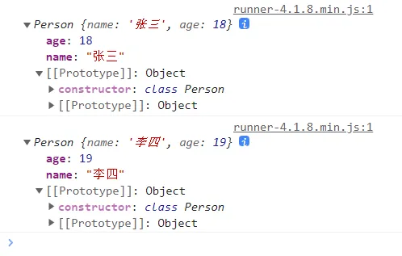
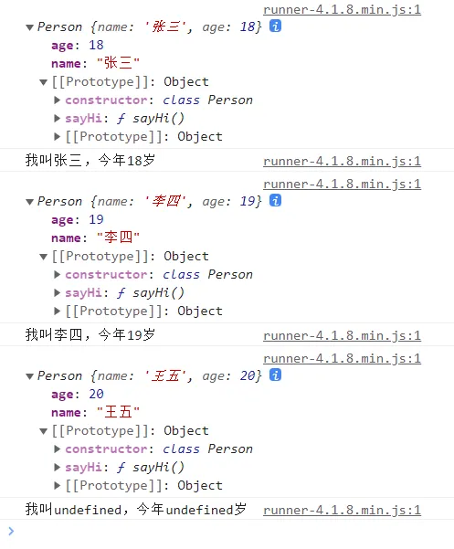
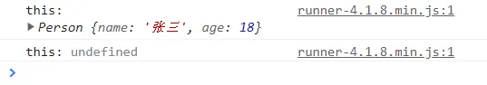
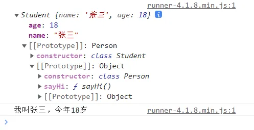
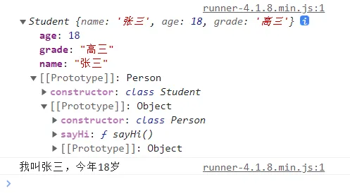
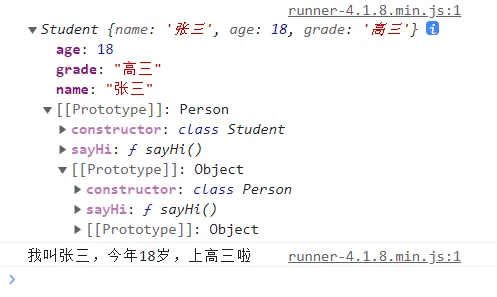
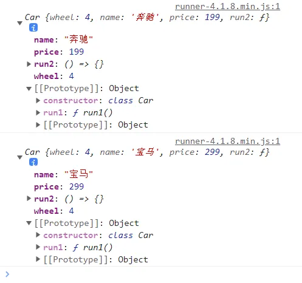
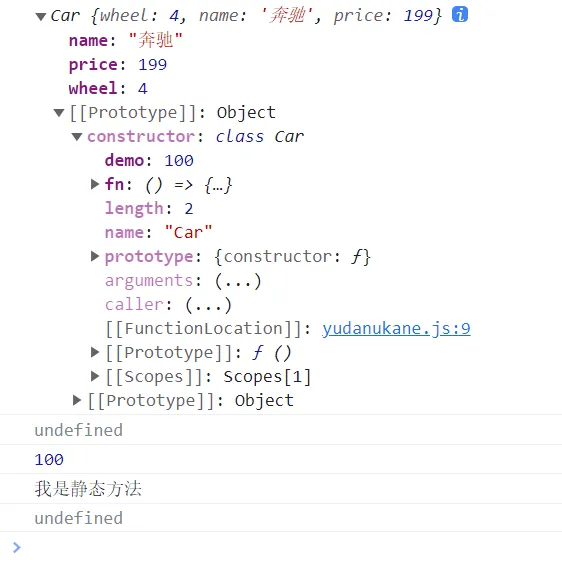

# Class

## 创建类和类的实例对象

```js
// 定义一个 Person 类
class Person {}

// 创建 Person 类的实例对象
const p1 = new Person()
console.log(p1)
```


## 构造器方法（constructor）

类本身只是一个特殊的函数，而构造器函数则是用来创建类的实例对象的。

```js
class Person {
  // 构造器方法在类的原型对象上
  // 构造器方法中的属性在类的实例对象身上
  constructor(name, age) {
    // 构造器中的 this 指向的是类的实例对象
    this.name = name
    this.age = age
  }
}

const p1 = new Person('张三', 18)
const p2 = new Person('李四', 19)
console.log(p1)
console.log(p2)
```



## 一般方法

```js
class Person {
  constructor(name, age) {
    this.name = name
    this.age = age
  }
  // 一般方法在类的原型对象上，供实例对象使用
  sayHi() {
    // 通过 Person 的实例对象调用方法时，方法中的 this 就是类的实例对象
    console.log(`我叫${this.name}，今年${this.age}岁`)
  }
}

const p1 = new Person('张三', 18)
console.log(p1)
p1.sayHi()

const p2 = new Person('李四', 19)
console.log(p2)
p2.sayHi()

const p3 = new Person('王五', 20)
console.log(p3)

// 通过 call 方法改变了 this 指向，sayHi 方法中的 this 不再指向实例对象
p3.sayHi.call({ a: '1', b: '2' })
```



## 类中的方法中的 this 指向

函数存在于堆内存中，函数中的 `this` 具体指向什么，就要看函数是怎么调用的。

```js
class Person {
  constructor(name, age) {
    this.name = name
    this.age = age
  }
  sayHi() {
    console.log('this:', this)
  }
}

const p1 = new Person('张三', 18)
p1.sayHi()  // 通过实例调用

// p1.sayHi 是一个函数，存在于堆内存中，可以把这个函数赋值给其他变量
const x = p1.sayHi
x()         // 直接调用
// 相当于 window.x.call(window)，this 指向 window
// 但由于类中定义的方法默认开启了严格模式，所以 this 就成了 undefined
```



## 继承

```js
class Person {
  constructor(name, age) {
    this.name = name
    this.age = age
  }
  sayHi() {
    console.log(`我叫${this.name}，今年${this.age}岁`)
  }
}

// 创建 Student 类，Student 类继承 Person 类
class Student extends Person {
  // Student 类中可以不写构造器，因为它继承了 Person 的构造器及方法
  // Person 类的构造器中的属性会出现在 Student 类的实例对象身上
  // Person 类的方法还是在 Person 类的原型对象上
  // 所以使用 Student 类时，可以正常使用 Person 类中的属性和方法
}

const s1 = new Student('张三', 18)
console.log(s1)
```



## 构造器中的 super

如果一个类与它的父类接收的属性不一样，那么这个类中就要写自己的构造器。

子类中如果写了构造器，就必须在构造器中调用 `super` 方法，以此来继承父类中的属性。

```js
class Person {
  constructor(name, age) {
    this.name = name
    this.age = age
  }
  sayHi() {
    console.log(`我叫${this.name}，今年${this.age}岁`)
  }
}

class Student extends Person {
  constructor(name, age, grade) {
    // super 会帮你调用父类的构造器方法，拿到父类构造器方法中的属性，放在 Student 类的实例对象身上
    // super 必须在最开始调用
    super(name, age)
    this.grade = grade
  }
}

const s1 = new Student('张三', 18, '高三')
console.log(s1)
```



## 重写（覆盖）父类的方法

子类继承了父类，就可以调用父类原型上的方法。

子类也可以重写一个与父类原型上相同的方法，以此来覆盖该方法。

```js
class Person {
  constructor(name, age) {
    this.name = name
    this.age = age
  }
  sayHi() {
    console.log(`我叫${this.name}，今年${this.age}岁`)
  }
}

class Student extends Person {
  constructor(name, age, grade) {
    super(name, age)
    this.grade = grade
  }
  // 重写（覆盖）从父类继承的方法
  sayHi() {
    console.log(`我叫${this.name}，今年${this.age}岁，上${this.grade}啦`)
  }
}

const s1 = new Student('张三', 18, '高三')
console.log(s1)
s1.sayHi()
```



## 在实例自身直接定义属性和方法

类中可以写赋值语句，以这种方式定义的属性和方法，会出现在实例对象自身。

```js
class Car {
  // wheel 会出现在实例对象自身，等同于在构造器中写 this.wheel = 4
  wheel = 4

  // 如果属性是传进来的，那么就要用 constructor 接收
  constructor(name, price) {
    this.name = name
    this.price = price
    // this.wheel = 4
  }

  // 这种写法，方法会出现在类的原型上
  run1() {}
  // 这种赋值写法，方法会出现在实例对象自身，相当于上面的 wheel = 4
  run2 = () => {}
}

// 如果有子类继承 Car 类，那么 Car 类中的 wheel 属性、run2 方法也会被继承

const c1 = new Car('奔驰', 199)
const c2 = new Car('宝马', 299)
console.log(c1)
console.log(c2)
```



## 在类自身定义属性和方法（static）

使用 `static` 关键字定义的属性和方法，会出现在类的自身，而不是实例对象身上，所以需要通过类来调用这些属性和方法，这些属性和方法也被称为“静态属性”和“静态方法”。

```js
class Car {
  // wheel 会出现在实例对象自身
  wheel = 4
  // demo 会出现在类的自身，通过实例对象无法访问该属性
  static demo = 100
  static fn = () => {
    console.log('我是静态方法')
    // 静态方法中的 this 指向的不是实例对象，因为无法通过实例对象来调用
    // 静态方法中的 this 指向的类本身，即 Car 类
  }
  constructor(name, price) {
    this.name = name
    this.price = price
  }
}

// 如果有子类继承了 Car 类，那么 Car 类中的 demo 属性也会被继承

const c1 = new Car('奔驰', 199)

console.log(c1)
console.log(c1.demo)    // undefined
// console.log(c1.fn())    // 报错：c1.fn is not a function

console.log(Car.demo)   // 100
console.log(Car.fn())   // 我是静态方法
```



## 总结

- 类中的构造器不是必须的，要对实例进行一些初始化的操作（如添加指定属性）时才写。
- 如果 A 类继承了 B 类，且 A 类中写了构造器，那么 A 类构造器中的 `super` 必须调用。
- 类中定义的方法，都是放在了类的原型对象上，供实例对象使用。
