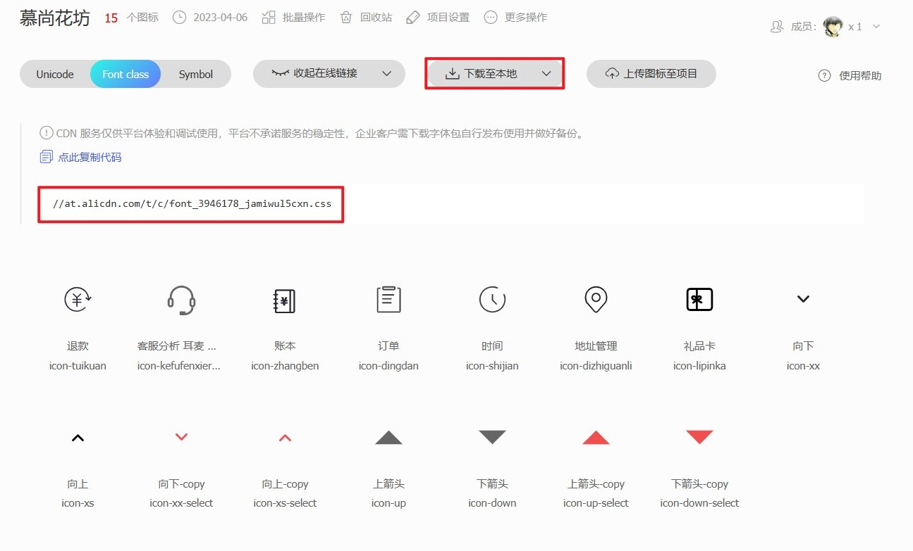
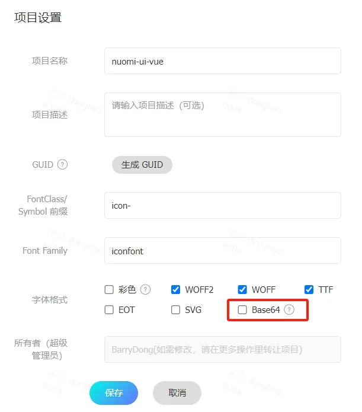

# 常用组件和样式

小程序中不能使用 HTML 标签，也没有 DOM、BOM，也仅支持部分 CSS 选择器。

## 常用组件

`view` 是容器组件，类似于 `div`，也是一个块级元素，独占一行。

`text` 是文本组件，类似于 `span`，是行内元素。
- 除了文本节点以外，其他的节点都无法长按选中。
- `text` 组件内只能嵌套 `text` 组件。

`swiper`、`swiper-item`：轮播图组件。
- `swiper` 中只能包含 `swiper-item`，否则会导致未定义的行为。
- `swiper-item` 只能放在 `swiper` 中，宽高自动设置为 100%。

`image`：图片组件，不设置 `src` 也占据宽高，默认 320px * 240px。

`navigator`：导航组件，可使用 `url` 属性指定当前小程序内的跳转路径，使用 `open-type` 属性指定跳转方式。
- 跳转路径时，路径后可以携带查询参数，在被打开页面的 `onLoad(options)` 中可以获取到参数。
- 属性 `open-type="switchTab"` 时不支持传参。

`scroll-view`：滚动视图组件，支持横向、纵向滚动，纵向滚动时，要给 `scroll-view` 设置固定高度。

## 尺寸单位 rpx

`rpx` 是响应式单位，可以根据屏幕宽度进行自适应，解决了不同屏幕宽度手机的适配问题。

小程序规定，任何型号手机的屏幕宽度都为 750rpx。

UI 一般会以 iPhone6 作为视觉稿的标准，即小程序的设计稿宽度一般为 750px。

```css
/* 需求：绘制一个盒子，让盒子的宽度占据屏幕的一半 */

.box {
  width: 375rpx;
  height: 600rpx;
  background-color: lightgreen;
}
```

以上代码，由于小程序规定任何型号手机屏幕宽度都是 750rpx，所以 `width: 375rpx` 在任何手机上都占据屏幕宽度的一半。

## 全局样式和局部样式

根目录中的 `app.wxss` 是全局样式，页面目录中的 `.wxss` 是局部样式。

如果有相同的样式规则，局部样式会覆盖全局样式。

## 使用字体图标

1. 下载要使用的字体图标。

    

    :::caution
    由于小程序不支持 `svg` 标签，所以在使用 iconfont 时，不要选择 Symbol。
    :::

2. 将下载后的 `.css` 文件后缀改为 `.wxss` 或 `.scss`，并保存到根目录下的 `static` 目录中。

3. 在全局样式文件 `app.wxss` 中引入下载的字体图标文件，就可以在项目中使用这些字体图标了。

    ```css title="app.wxss 中引入"
    @import "./static/iconfont.wxss";
    
    .iconfont {
      font-size: 24rpx;
    }
    ```
    
    ```html title="使用字体图标"
    <view class="iconfont icon-tuikuan"></view>
    ```

使用字体图标时，控制台可能会报 `[渲染层网络错误] Failed to load font` 的错误，这个错误可以忽略。

如果错误影响开发调试，可以在 iconfont 中将字体图标转换成 Base64 格式下载。



## 背景图片

小程序的 `background-image` 不支持本地路径。


解决方案：使用网络图片，或者 base64，或者 `image` 组件。

```css
.box {
  /* 网络图片 */
  background-image: url('http://8.131.91.46:6677/TomAndJerry.jpg');
  /* base64 */
  background-image: url("data:image/jpeg;base64,/9j/4AAQSkZJRgABAQEAeAB4AAD/.....")
}
```
