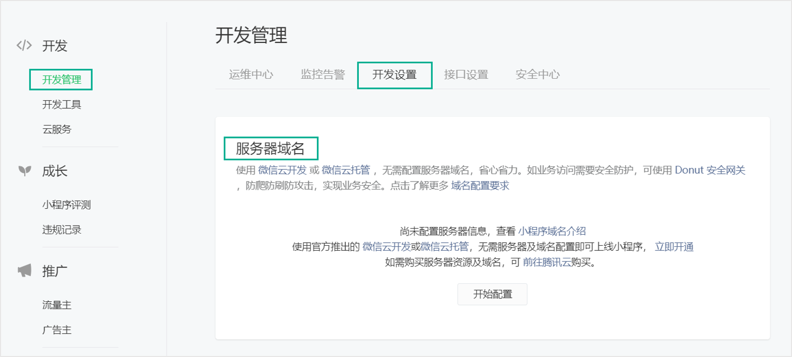

# 小程序 API

## API 基础

小程序的 API 都挂载在 `wx` 对象身上，`wx` 对象是小程序的宿主环境微信所提供的全局对象。

小程序 API 有以下几种类型：

- 事件监听 API：以 `on` 开头，用来监听某个事件是否触发，如 `wx.onThemeChange()`。
- 同步 API：以 `Sync` 结尾，如 `wx.setStorageSync()`。
- 异步 API：大多数 API 都是异步 API，如 `wx.setStorage()`。

异步 API 支持 callback 和 Promise 两种调用方式。

- 当 API 的参数对象中不包含 success/fail/complete 等回调时，默认返回 Promise。
- 部分接口如 `request`、`uploadFile` 本身就有返回值，所以不支持 Promise 风格的调用方式，它们的 promisify 需要开发者自行封装。

## 网络请求

小程序使用 `wx.request()` 发起 HTTPS 网络请求。

```js
wx.request({
  // 接口地址，仅为示例，并非真实的接口地址
  url: 'example.php',
  // 请求的参数
  data: { x: '123' },
  // 请求方式
  method: 'GET|POST|PUT|DELETE',
  success(res) {
    console.log(res.data)
  },
  fail(err) {
    console.log(err)
  }
})
```

开发者工具、小程序的开发版和体验版允许 `wx.request` 请求任意域名，只需在开发者工具中勾选“不校验合法域名”即可。

:::caution
- 正式版小程序使用 `wx.request()` 请求的域名要在小程序管理后台进行配置，否则会报错。
- 域名只支持 `https` 且要求已备案。


:::

## 界面交互

### loading 提示框

`wx.showLoading` 与 `wx.hideLoading` 通常配合发送请求时使用。

```js
wx.showLoading({
  title: '提示内容', // 提示的内容
  mask: true,       // 是否显示透明蒙层，防止触摸穿透
  success() {},     // 成功的回调
  fail() {},        // 失败的回调
})

wx.hideLoading()
```

### 消息提示框

```js
wx.showToast({
  title: '标题',     // 提示的内容
  duration: 2000,   // 提示的延迟时间
  mask: true,       // 是否显示透明蒙层，防止触摸穿透
  icon: 'success',  // 图标
  success() {},     // 成功的回调
  fail() {},        // 失败的回调
})
```

### 模态对话框

```js title="以 Promise 风格调用"
Page({
  async handler(e) {
    const { confirm } = await wx.showModal({
      title: '提示',
      content: '您确定执行该操作吗？',
      confirmColor: '#f3514f',
    })
    if (confirm) {
      // 用户点击确定按钮
    }
  }
})
```

## 本地存储

| 同步 API                 | 异步 API             | 作用        |
|------------------------|--------------------|-----------|
| `wx.setStorageSync`    | `wx.setStorage`    | 存储数据到本地缓存 |
| `wx.getStorageSync`    | `wx.getStorage`    | 从本地缓存获取数据 |
| `wx.removeStorageSync` | `wx.removeStorage` | 从本地缓存移除数据 |
| `wx.clearStorageSync`  | `wx.clearStorage`  | 清空本地数据缓存  |

同步 API 在使用时比较简洁，缺点是同步会阻塞程序执行，执行效率上相较异步 API 要差一些。

:::tip
复杂类型的数据，可以直接存储和获取，无需使用 `JSON.stringify`、`JSON.parse` 转换。
:::

## 路由与通信

在小程序中实现页面的跳转，有两种方式：声明式导航（`navigator` 组件）、编程式导航（API）。

路由跳转相关的 API：

- `wx.navigateTo()`：保留当前页面，跳转到应用内的某个页面，但不能跳到 tabBar 页面。
- `wx.redirectTo()`：销毁当前页面，跳转到应用内的某个页面，但不能跳到 tabBar 页面。
- `wx.reLaunch()`：销毁所有页面，跳转到应用内的某个页面（可以打开任意页面）。
- `wx.navigateBack()`：销毁当前页面，返回上一页面或多级页面。
- `wx.switchTab()`：只能跳转到 tabBar 页面。

路由传参：

- `wx.navigateTo()`、`wx.redirectTo()`、`wx.reLaunch()` 都是正常的路由跳转，路径中可以携带查询参数，在被打开页面的 `onLoad(options)` 钩子中可以获取传递的查询参数。
- `wx.switchTab()` 是 tabBar 页面的切换，路径后不能带参数。

## 事件监听

**上拉加载**

1. 在 app.json 或 page.json 中配置距离页面底部距离 `onReachBottomDistance` 字段，该字段默认 `50px`。
2. 在 page.js 中定义 `onReachBottom` 事件监听页面触底。

**下拉刷新**

1. 在 app.json 或 page.json 中配置 `enablePullDownRefresh` 允许下拉，同时可以配置窗口、loading 样式等。
2. 在 page.js 中定义 `onPullDownRefresh` 事件监听用户下拉。

:::caution
在下拉刷新以后，loading 效果有可能不会回弹回去，此时可以调用 `wx.stopPullDownRefresh()` 手动停止下拉刷新。
:::

:::tip
`scroll-view` 组件也可以实现上拉加载、下拉刷新功能。
:::
