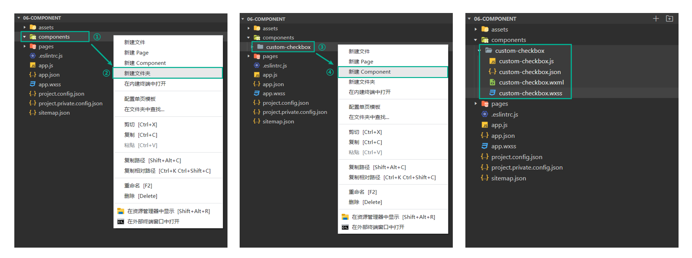

import Tabs from '@theme/Tabs';
import TabItem from '@theme/TabItem';

# 自定义组件

## 创建和使用自定义组件

如下图所示，在 components 目录中创建一个自定义组件。



自定义组件需要在 组件.json 文件中配置 `component: true`。

```json
{
  "component": true,
  "usingComponents": {}
}
```

自定义组件可以全局注册和局部注册。

- 全局注册：在 app.json 中配置 `usingComponents`。
- 局部注册：在 page.json 中配置 `usingComponents`。

```json title="注册组件"
{
  "usingComponents": {
    // 组件名：组件路径
    "custom-checkbox": "/components/custom-checkbox/custom-checkbox"
  }
}
```

```html title="使用组件"
<view>
  <custom-checkbox />
</view>
```

## 数据和方法

组件的数据定义在 `data` 中，方法定义在 `methods` 中。

```js
Component({
  data: {
    isChecked: false
  },
  methods: {
    updateChecked () {
      this.setData({ isChecked: !this.data.isChecked })
    }
  }
})
```

## 属性

`properties` 用于定义组件可以接收哪些属性，这些属性可以在组件的 wxml 中直接使用。

传递给组件的属性的数据类型可以是 String、Number、Boolean、Object、Array，不能是其他类型。

```js
Component({
  properties: {
    // 简写形式
    // label: String

    // 完整写法
    label: {
      type: String,   // type 也可以设置为 null，表示不限制类型
      value: ''
    },
    position: {
      type: String,
      value: 'right', // value 定义默认值
    }
  },
})
```

:::caution
- 一般来说，不建议在组件内部直接修改 `properties` 中定义的属性，这会造成数据流的混乱！
- 如果非要修改，也是通过 `this.setData()` 进行修改。
:::

## slot

默认情况下，一个组件只能有一个插槽（默认插槽）。

```html
<view>
  <!-- 默认插槽 -->
  <slot />
</view>
```

如果要定义多个插槽，需要在组件的 .js 中声明，同时给 slot 添加不同的 `name` 来区分。

```js
Component({
  options: {
    // 启用多 slot 支持
    multipleSlots: true
  }
})
```

```html
<view>
  <!-- 具名插槽 -->
  <slot name="slot-top" />

  <!-- 默认插槽 -->
  <view>
    <slot />
  </view>

  <!-- 具名插槽 -->
  <slot name="slot-bottom" />
</view>
```

使用自定义组件时，传递插槽内容方式如下。

```html
<my-component>
  <text slot="slot-top">顶部内容</text>

  <!-- 默认情况下，自定义组件的子节点内容不会展示 -->
  <!-- 如果想内容进行展示，需要在组件模板中定义 slot 节点 -->
  子节点内容

  <text slot="slot-bottom">底部内容</text>
<my-component/>
```

:::tip
`<slot />` 只是一个占位符，子节点内容会将 `<slot />` 进行替换。
:::

## 组件样式

### 选择器的使用注意事项

**使用类选择器**

- app.wxss 或 page.wxss 中使用标签选择器（或其他特殊的选择器），标签选择器的样式会影响到全局组件或当前页面的所有组件，通常情况下这是不推荐的做法。
- 组件和引用组件的页面，不能使用 id 选择器、属性选择器、标签选择器，应使用类选择器。

**后代选择器**

- 后代选择器（`.a .b`），在一些极端情况下可能会出现非预期的表现，如果遇到了，就不要使用。
- 子元素选择器（`.a > .b`）只能用于 `view` 组件与其子节点之间，用于其他组件可能会样式失效。

**样式的继承**

- 可继承样式（如 `font`、`color`），会从组件外继承到组件内。
- 除继承样式外，全局样式、组件所在页面的样式对自定义组件无效，除非更改组件样式隔离选项。

### 组件样式隔离

默认情况下，自定义组件的样式只受到自身的 wxss 影响。除非以下两种情况：

- app.wxss 或 page.wxss 中使用标签选择器，标签选择器的样式会影响到页面和全部组件，通常情况下这是不推荐的做法。
- 设置了特殊的样式隔离选项 `styleIsolation`。

`styleIsolation` 支持以下取值：

- `isolated`：默认值，表示启用样式隔离。组件和组件使用者如果存在相同的类名，样式不会相互影响。
- `apply-shared`：表示页面 wxss 样式会影响到组件，但组件 wxss 中指定的样式不会影响到页面。
- `shared`：表示页面 wxss 样式会影响到组件，组件 wxss 样式也会影响页面和其他设置了 `apply-shared` 或 `shared` 的自定义组件。

```js
Component({
  options: {
    styleIsolation: 'isolated'
  }
})
```

### 修改内置组件的样式

在全局样式文件、页面样式文件中修改内置组件的样式，可以通过内置组件的类名修改。

在自定义组件中修改内置组件的样式，也可以通过内置组件的类名修改，但还需要设置 `styleIsolation: 'shared'`。

如果只想在当前组件内修改内置组件的样式，可以添加命名空间。

```html title="给内置组件添加命名空间"
<checkbox class="custom-checkbox" />

<style>
/* .custom-checkbox 是给 checkbox 组件添加的类名（命名空间） */
.custom-checkbox .wx-checkbox-input {
  width: 24rpx !important;
  height: 24rpx !important;
  border-radius: 50% !important;
  border: 1px solid #fda007 !important;
  margin-top: -6rpx;
}
.custom-checkbox .wx-checkbox-input-checked {
  background-color: #fda007 !important;
}
.custom-checkbox .wx-checkbox-input.wx-checkbox-input-checked:before {
  font-size: 22rpx;
  color: #fff;
}
</style>
```

## 数据监听器

`observers` 用于监听 `data` 中的数据的变化，相当于 Vue 中的 `watch`。

```js
Component({
  data: {
    num: 10,
    count: 1,
    obj: { name: 'Tom', age: 10 },
    arr: [1, 2, 3]
  },
  observers: {
    num(newVal) {
      console.log(newVal)
    },
    // 同时监听多个
    'num, count'(newNum, newCount) {
      console.log(newNum, newCount)
    },
    // 监听对象内部数据
    'obj.age'(newAge) {
      console.log(newAge)
    },
    // 监听对象内部所有字段变化，可以使用通配符 ** 
    'obj.**'(newObj) {
      console.log(newObj)
    },
    // 监听数组内部数据
    'arr[0]'(newVal) {
      console.log(newVal)
    }
  }
})
```

`observers` 也可以监听 `properties` 中的属性的变化，当组件使用者传递了数据或修改了数据，监听器会立即执行。也就是说，它一上来就会执行一次。

## 组件通信

### 父子组件传值

父传子：父组件在 wxml 中向子组件绑定数据，子组件使用 `properties` 接收。

```html title="父组件"
<view>
  <costom prop-a="{{ name }}" prop-b="{{ age }}" />
</view>
```

```js title="子组件"
Component({
  properties: {
    // 完整写法
    propA: {
      type: String,
      value: ''
    },
    // 简写形式
    propB: Number
  },
})
```

子传父：子组件使用 `triggerEvent` 触发自定义事件，父组件在子组件标签上 `bind` 自定义事件。

```js title="子组件"
Component({
  data: {
    num: 666
  },
  methods: {
    sendData () {
      // 触发自定义事件
      this.triggerEvent('myevent', this.data.num)
    }
  }
})
```

```jsx title="父组件"
<custom-com bind:myevent="getData" />

Page({
  data: {
    num: ''
  },
  getData(event) {
    // 通过 event.detail 获取子组件传递给父组件的数据
    console.log(event.detail)
  }
})
```

### 获取组件实例

在父组件中调用 `this.selectComponent(选择器)`，获取子组件实例，从而访问子组件数据和方法。

```jsx title="父组件"
<costom class="custom" />
<button bindtap="getChildComponent"></button>

Page({
  getChildComponent() {
    const child = this.selectComponent('.custom')
    console.log(child)
  }
})
```

## 生命周期

### 组件生命周期

组件的生命周期函数在 `lifetimes` 字段内声明。

```js
Component({
  lifetimes: {
    created() {
      // 组件实例创建完成时执行
      // 此时调用 setData 没效果，因为还没有对模板进行解析
      // 可以在这里为组件添加一些自定义属性
      this.test = '测试'
    },
    attached() {
      // 组件初始化完毕时执行
      // 此时模板已经解析完毕，并且组件已经挂载到页面上
      // 可以在这里写交互逻辑
    },
    detached() {
      // 组件实例被从页面节点树移除时执行（组件被销毁）
      // 退出一个页面时，如果组件还在页面节点树中，detached 也会被触发
    },
    ready() {
      // 在组件布局完成后执行
    },
    moved() {
      // 在组件实例被移动到节点树另一个位置时执行
    },
  }
})
```

### 组件所在页面的生命周期

组件内部可以监听到组件所在页面的状态变化，如页面的展示、隐藏等。

组件所在页面的生命周期在 `pageLifetimes` 字段内声明。

```js
Component({
  pageLifetimes: {
    show() {
      // 组件所在页面展示时触发（后台切前台）
    },
    hide() {
      // 组件所在页面隐藏时触发（前台切后台、点击 tabBar）
    },
    resize() {},
    routeDone() {}
  }
})
```

### 生命周期总结

一个小程序完整的生命周期由**应用生命周期**、**页面生命周期**和**组件生命周期**三部分组成。

import coldBoot from './images/生命周期-冷启动.png'
import hotBoot from './images/生命周期-热启动.png'
import pageJump from './images/生命周期-页面跳转.png'

<Tabs>
  <TabItem value="coldBoot" label="冷启动" default>
    
  </TabItem>
  <TabItem value="hotBoot" label="热启动">
    
  </TabItem>
  <TabItem value="pageJump" label="页面跳转">
    
  </TabItem>
</Tabs>

## 使用 Component 构造页面

`Component` 方法用于创建一个自定义组件，页面也可以看成是组件，所以 `Component` 方法也可以用来创建页面，而且 `Component` 方法比 `Page` 方法更强大，可以实现更复杂的页面逻辑开发。

:::tip
这并不是在页面中引入一个组件，而是直接在 page.js 中使用 `Component()` 代替 `Page()` 来构造页面。
:::

:::caution
- 对应的 .json 文件中要包含 `usingComponents` 字段。
- 页面中的生命周期钩子、事件监听方法等，在组件中要写在 `methods` 中才生效。
- 组件的 `properties` 可用于接收页面查询参数，在 `onLoad()` 中可通过 `this.data` 拿到页面查询参数。
:::

```js title="page.js"
Component({
  properties: {
    // id 和 title 是页面查询参数，可以在 properties 中声明接收
    id: String,
    title: String
  },
  data: {
    name: 'tom'
  },
  methods: {
    updateName() {
      this.setData({ name: 'jerry' })
    },
    onLoad(options) {   // onLoad 中也仍然可以接收到页面参数
      console.log(options)
      // 通过 this.data、this.properties 都可以拿到 properties 中声明的属性
      console.log(this.data.id)
      console.log(this.data.title)
      console.log(this.properties.id)
    },
  }
})
```

## 组件复用机制 behaviors

behaviors 是一种代码复用的方式，相当于 Vue 的 mixin，可以将一些通用的逻辑和方法提取出来，然后在多个组件中复用，减少代码冗余。

组件中引用 behaviors 时，它的属性、数据和方法会被合并到组件中，生命周期函数也会在对应时机被调用。

```js title="my-behavior.js"
// 使用 Behavior() 方法定义一个 behavior

export default Behavior({
  behaviors: [],
  properties: {
    myBehaviorProperty: {
      type: String
    }
  },
  data: {
    myBehaviorData: 'my-behavior-data'
  },
  // TODO: 生命周期可以写 methods 外面？
  created() {
    console.log('[my-behavior] created')
  },
  attached() {
    console.log('[my-behavior] attached')
  },
  ready() {
    console.log('[my-behavior] ready')
  },
  methods: {
    myBehaviorMethod() {
      console.log('[my-behavior] log by myBehaviorMehtod')
    },
  }
})
```

```js
import myBehavior from 'my-behavior.js'

Component({
  behaviors: [myBehavior]
})
```

当组件中与引入的 behaviors 中有同名的字段，处理方式如下：

- 如果是同名的属性、数据或方法，组件会覆盖 behaviors 中的同名属性、数据或方法。
- 如果同名的数据是对象类型，会进行对象合并。
- 生命周期函数和 observers 不会相互覆盖，而是在对应时机都会执行。

## 外部样式类

默认情况下，组件和组件使用者之间如果存在相同的类名，它们的样式不会相互影响。

组件使用者如果想修改组件的样式，就要解除样式隔离，但是解除样式隔离以后，在极端情况下，可能会产生样式冲突、CSS 嵌套太深等问题。

子组件可以在不解除样式隔离的情况下，通过 `externalClasses` 字段定义多个“外部样式类”，组件外部可通过这些类来修改子组件的样式。

“外部样式类”使用步骤：

1. 在组件中用 `externalClasses` 定义若干个外部样式类。
2. 自定义组件标签通过“属性绑定”的方式提供一个样式类，属性是 `externalClasses` 定义的元素，属性值是传递的类名。

```jsx title="自定义组件"
<!-- 在同一个节点上，如果存在同名的 外部样式类 和 普通的样式类 -->
<!-- 两个类的优先级是未定义的 -->
<!-- 建议：在使用外部样式类的时，样式需要通过 !important 添加权重 -->
<view class="extend-class box">通过外部样式类修改组件的样式</view>

Component({
  // 接收组件使用者传递的外部样式类
  externalClasses: ['extend-class']
})
```

```html title="使用组件"
<!-- 属性是在子组件的 externalClasses 里面定义的元素 -->
<!-- 属性值必须是一个类名 -->
<custom09 extend-class="box" />

<style>
.box {
  color: lightsalmon !important;
}
</style>
```

:::warning
当组件的 `styleIsolation` 为 `shared`，`externalClasses` 会失效。
:::
