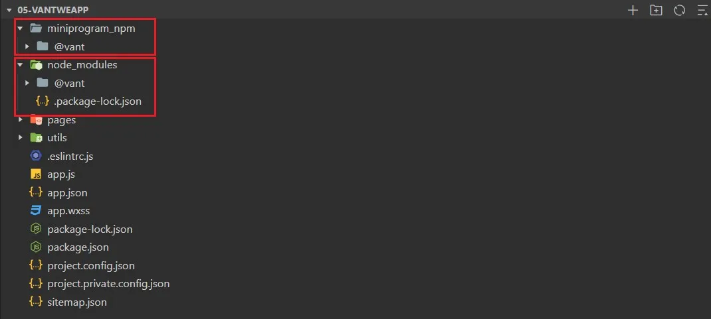
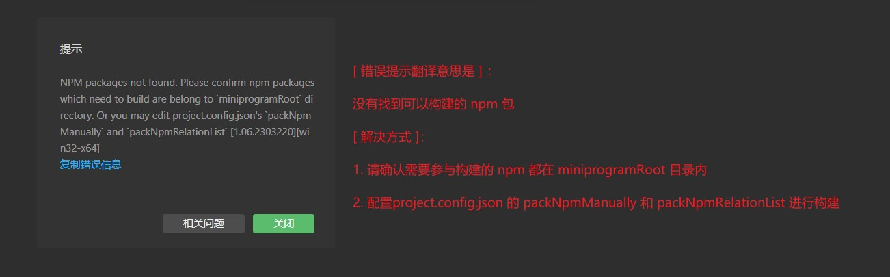

# npm 支持

## 构建 npm

小程序已经支持安装 npm 包，但这些 npm 包在小程序中不能直接使用，因为 `node_modules` 中的包不会参与小程序的编译、上传和打包，所以这些包要经过小程序开发者工具构建后才能使用。

在构建成功后，会在小程序项目根目录中生成 `miniprogram_npm` 目录，里面存放着构建打包后的 npm 包，也就是小程序运行过程中真正使用的包。

:::caution
- 因小程序运行环境（微信）的特殊性，并不是所有的 npm 包都能在小程序中使用。
- 小程序中使用的 npm 包都是专门为小程序定制的。
- 在使用 npm 包前，需确认该包是否支持小程序。
:::

### 构建 npm 步骤：以安装 Vant Weapp 为例

1. 初始化 package.json。

   ```bash
   npm init -y
   ```

2. npm 安装项目依赖。

   ```bash
   npm i @vant/weapp -S --production
   ```

3. 微信开发者工具构建 npm：“工具” -> “构建 npm”。

   

   至此，npm 包的构建已经完成。

4. 但 Vant 组件库会和基础组件的样式冲突，所以还要配置 app.json，将 `"style": "v2"` 去掉。

   `"style": "v2"` 表示启用小程序最新版的组件样式，但最新版的组件强加了很多样式，且难以覆盖。而 Vant 的组件需要覆盖小程序的组件样式，所以要去掉 `"style": "v2"`，表示不启用小程序最新版的组件样式，否则会导致组件样式的冲突。

### 使用 Vant 的组件

```json title="1. 在 app.json 或 page.json 中注册组件"
{
  "usingComponents": {
    "van-button": "@vant/weapp/button/index"
  }
}
```

```html title="2. 在 wxml 中使用组件"
<van-button type="default">默认按钮</van-button>
<van-button type="primary">主要按钮</van-button>
<van-button type="info">信息按钮</van-button>
<van-button type="warning">警告按钮</van-button>
<van-button type="danger">危险按钮</van-button>
```

## 自定义构建 npm

当项目越来越复杂，我们可能会对项目的目录结构进行调整优化，比如将小程序核心源码放到 miniprogram 目录中（相当于 Vue 项目的 src 目录）。

但调整目录结构后，再次构建 npm，可能会报以下错误。



产生这个错误的原因是小程序的构建方式有两种：默认构建 npm、自定义构建 npm。

### 默认构建 npm

默认情况下，不使用任何模版，project.config.json 中的 `miniprogramRoot` 字段就是小程序项目根目录。

在根目录中配置了 `package.json` 并执行 `npm install` 后，根目录下就有了 `node_modules`，然后对 `node_modules` 中的 npm 包进行构建，就会在根目录下生成 `miniprogram_npm`。

### 自定义构建 npm

为了更好的优化目录结构，更好的管理项目中的代码，需要用到自定义构建 npm。

自定义构建 npm，要在 `project.config.json` 中对 node_modules 和目标 miniprogram_npm 的位置进行配置。

```json
{
  // 新增 miniprogramRoot 字段，指定小程序核心源码的目录
  "miniprogramRoot": "miniprogram/",
  "setting": {
    // 开启自定义构建 npm
    "packNpmManually": true,
    // 指定 packageJsonPath 和 miniprogramNpmDistDir 的位置
    "packNpmRelationList": [
      {
        // packageJsonPath 表示 node_modules 对应的 package.json 文件的路径
        "packageJsonPath": "./package.json",
        // miniprogramNpmDistDir 表示 node_modules 的构建结果放在哪个目录
        "miniprogramNpmDistDir": "./miniprogram"
      }
    ]
  }
}
```

## Vant 组件样式覆盖

[Vant Weapp 样式覆盖](https://vant.pro/vant-weapp/#/custom-style) |
[Vant Weapp 主题定制](https://vant.pro/vant-weapp/#/theme)

:::tip
覆盖组件样式时，可以添加 `!important`，确保样式的优先级最高。
:::

### 使用 CSS 变量

1. 定义 CSS 变量。

   ```css title="定义全局 CSS 变量"
   /* app.css */
   
   page {
     --main-bg-color: lightcoral;
   }
   ```
   
   ```css title="定义局部 CSS 变量"
   /* 只有被当前类名容器包裹的元素，使用该变量才生效 */
   
   .container {
     --main-bg-color: lightseagreen;
   }
   ```

2. 使用 CSS 变量。

   ```css title="使用局部 CSS 变量"
   /*
     wxml 中元素层级关系：
     <view class="container">
       <van-button type="default" custom-class="custom-class">按钮</van-button>
     </view>
   */
   
   .custom-class {
     background-color: var(--main-bg-color) !important;
   }
   ```

### 直接在组件上添加类名

```html
<van-button type="primary" class="my-button">主要按钮</van-button>
```

```css
.my-button {
  --color: rgb(221, 152, 24);
}

.van-button--primary {
  font-size: 28rpx !important;
  background-color: var(--color) !important;
  border: 1px solid var(--color) !important;
}
```
