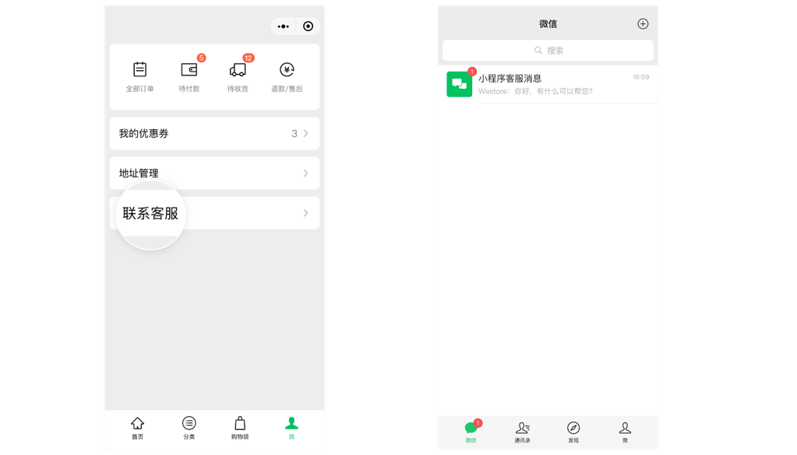
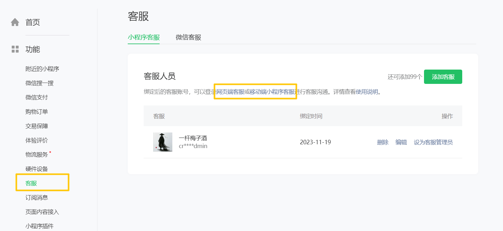

# 开放能力

## 获取用户头像

1. 将 `button` 组件的 `open-type` 属性设置为 `chooseAvatar`。
2. 用户选择头像后，可以通过 `bindchooseavatar` 事件回调获取到头像信息的临时路径。

```html
<button open-type="chooseAvatar" bindchooseavatar="getAvatar">按钮</button>

<script>
  Page({
    getAvatar(event) {
      // 获取的微信头像是临时路径，临时路径是有失效时间的
      // 实际开发中，需要将临时路径上传到服务器保存
      const { avatarUrl } = event.detail
      console.log(avatarUrl)
    }
  })
</script>
```

## 获取用户昵称

1. 在 `form` 组件中使用 `input` 和 `button` 组件。
2. 为 `input` 组件设置 `type="nickname"`，为 `button` 组件设置 `form-type="submit"`。
3. 为 `form` 组件绑定 `submit` 事件，在事件处理函数中通过事件对象获取用户昵称。

```html
<form bindsubmit="onSubmit">
  <!-- 设置 type="nickname" 后，当用户点击输入框，键盘上方就会显示微信昵称 -->
  <!-- 如果添加了 name 属性，form 组件就会自动收集带有 name 属性的表单元素的值 -->
  <input type="nickname" name="nickname" placeholder="请输入昵称" />

  <!-- form-type="submit" 将按钮变为提交按钮 -->
  <!-- 在点击提交按钮时，会触发表单的 bindsubmit 提交事件 -->
  <button type="primary" plain form-type="submit">点击获取昵称</button>
</form>

<script>
  Page({
    onSubmit(event) {
      const { nickname } = event.detail.value
      console.log(nickname)
    }
  })
</script>
```

## 转发功能

在 page.js 中声明 `onShareAppMessage` 事件监听函数，并自定义转发内容。

此时有两种方式可以进行转发：

- 点击右上角菜单，选择弹出框中的“转发”按钮。
- 给 `button` 组件设置 `open-type="share"`，用户点击按钮就会触发 `Page.onShareAppMessage` 事件监听函数。

```html
<button open-type="share">转发</button>

<script>
  Page({
    // 监听页面按钮的转发 以及 右上角的转发按钮
    onShareAppMessage(obj) {
      // 如果是点按钮转发，obj.target 有值；如果是点右上角菜单转发，obj.target 无值
      console.log(obj.target)
      // 自定义转发内容
      return {
        // 转发标题
        title: '这是一个非常神奇的页面~~~',
        // 转发的页面路径，路径必须以 / 开头
        path: '/pages/cate/cate',
        // 自定义图片路径，可以是本地文件路径、代码包文件路径或者网络图片路径
        imageUrl: '../../assets/Jerry.png'
      }
    }
  })
</script>
```

## 分享到朋友圈

小程序页面默认不能被分享到朋友圈，需要设置“分享到朋友圈”才可以。

“分享到朋友圈”要满足两个条件：

1. 页面必须设置允许“发送给朋友”，即 page.js 中声明 `onShareAppMessage` 事件。
2. 页面必须设置允许“分享到朋友圈”，即 page.js 中声明 `onShareTimeline` 事件。

```js
Page({
  // 监听右上角 分享到朋友圈 按钮
  onShareTimeline() {
    return {
      // 自定义标题，即朋友圈列表页上显示的标题
      title: '帮我砍一刀~~~',
      // 自定义页面路径中携带的查询参数，如 path?a=1&b=2
      query: 'id=1',
      // 自定义图片路径，可以是本地图片或者网络图片
      imageUrl: '../../assets/Jerry.png'
    }
  }
})
```

## 手机号验证组件

用于向用户发起手机号申请，用户同意后，才能获得由平台验证后的手机号。

手机号验证组件可分为“快速验证”和“实时验证”。

- 快速验证：平台会对号码进行验证，但不保证是实时验证。
- 实时验证：在每次请求时，平台均会对用户选择的手机号进行实时验证。

:::caution
- 手机号验证组件目前仅针对非个人开发者，且完成了认证的小程序开放（不包含海外主体）。
- 手机号验证组件需要付费使用，每个小程序账号有 1000 次体验额度。
:::

```html
<button
  open-type="getPhoneNumber"
  bindgetphonenumber="getphonenumber"
>快速验证组件</button>

<button
  open-type="getRealtimePhoneNumber"
  bindgetrealtimephonenumber="getrealtimephonenumber"
>实时验证组件</button>

<script>
  Page({
    getphonenumber(event) {
      // 在 event.detail 中可以获取到 code（动态令牌），可以使用 code 换取手机号
      // 需要将 code 发送给后端，后端在接收到 code 后，需要调用 API 换取真正的手机号
      // 在换取成功以后，将手机号返回给前端
      console.log(event)
    },
    getrealtimephonenumber(event) {
      console.log(event)
    }
  })
</script>
```

## 客服能力

小程序为开发者提供了客服能力，同时为客服人员提供移动端、网页端客服工作台便于及时处理消息。



使用方式：

1. 为 `button` 组件设置 `open-type="contact"`，当用户点击后就会进入客服会话。

    ```html
    <button type="warn" plain open-type="contact">联系客服</button>
    ```

2. 在小程序管理后台，绑定后的客服账号，可以登录“网页端客服”或“移动端小程序”客服，来接收或发送客服消息。

    
