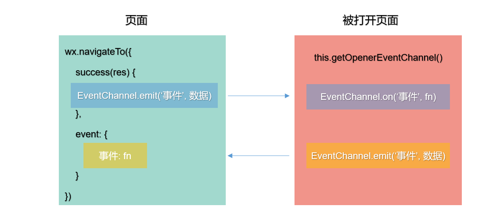

# 数据通信

## getApp

`getApp()` 用于获取小程序全局唯一的 App 实例，通过小程序应用实例可以实现数据或方法的共享。

:::caution
- 不要在 `App()` 方法中调用 `getApp()`，使用 `this` 就可以拿到 App 实例。
- 通过 `getApp()` 获取实例后，不要私自调用生命周期函数。
:::

```js title="app.js"
App({
  // 全局共享的数据
  globalData: {
    token: ''
  },
  // 全局共享的方法
  setToken(token) {
    // 在 App() 方法中可以通过 this 访问 App 实例
    this.globalData.token = token
  }
})
```

```js title="page.js"
// getApp() 方法用来获取全局唯一的 App 实例
const appInstance = getApp()

Page({
  login() {
    appInstance.setToken('fghioiuytfghjkoiuytghjoiug')
  }
})
```

## EventChannel

EventChannel 用于页面之间的通信。

如果一个页面通过 `wx.navigateTo` 打开一个新页面，这两个页面间将建立一条数据通道。

1. 在 `wx.navigateTo` 的 `success` 回调中可以通过参数获取 `EventChannel` 对象。
2. 被打开的页面可以通过 `this.getOpenerEventChannel()` 方法获取 `EventChannel` 对象。
3. `wx.navigateTo` 方法中可以定义 `events` 配置项，用于监听被打开页面触发的事件。

这两个 `EventChannel` 对象之间可以使用 `emit` 和 `on` 方法相互发送、监听事件。



```js title="页面.js"
Page({
  handler() {
    wx.navigateTo({
      url: '/pages/list/list',
      events: {
        // 监听被打开页面触发的 currentevent 事件
        currentevent: (res) => {
          console.log(res)
        }
      },
      success(res) {
        res.eventChannel.emit('myevent', { name: 'tom' })
      }
    })
  }
})
```

```js title="被打开页面.js"
Page({
  onLoad() {
    // 通过 this.getOpenerEventChannel() 可以获取 EventChannel 对象
    const EventChannel = this.getOpenerEventChannel()
    
    EventChannel.on('myevent', (res) => {
      console.log(res)
    })
    
    EventChannel.emit('currentevent', { age: 10 })
  }
})
```

## PubSubJS

在安装 pubsub 后，记得要进行构建 npm。
