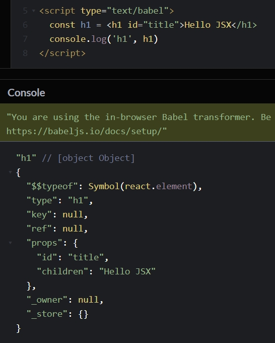

# React 入门

## React 简介

React 是 Facebook 开发的，于 2013年5月 开源。

React 是一个用于构建用户界面的 JavaScript 库。
> React 只关注界面，可以将数据渲染为 HTML 视图。

## Hello React

```html
<!DOCTYPE html>
<html lang="en">
  <head>
    <meta charset="UTF-8">
    <meta http-equiv="X-UA-Compatible" content="IE=edge">
    <meta name="viewport" content="width=device-width, initial-scale=1.0">
    <title>Hello React</title>
    
    <!-- 1. 引入 react 核心库 -->
    <script src="https://unpkg.com/react/umd/react.development.js"></script>
    <!-- 2. 引入 react-dom，用于支持 react 操作 DOM -->
    <script src="https://unpkg.com/react-dom/umd/react-dom.development.js"></script>
    <!-- 3. 引入 babel，用于将 jsx 转为 js -->
    <script src="https://unpkg.com/@babel/standalone/babel.min.js"></script>
    
  </head>
  <body>

	<!-- 4. React 渲染的容器（根元素） -->
    <div id="app"></div>

	<!-- 5. type="text/babel" -->
    <script type="text/babel">
      // 查看相关变量
      console.log('window.React:', window.React)
      console.log('window.React.createElement:', window.React.createElement)
      console.log('window.ReactDOM:', window.ReactDOM)
      console.log('window.ReactDOM.render:', window.ReactDOM.render)
      
      // 6. 创建虚拟 DOM
      //    这里的 h1 标签不要用引号引起来，因为 React 中写的是 JSX，这里的 h1 不是字符串，而是虚拟 DOM
      const VDOM = <h1>Hello React</h1>
      // 7. 渲染虚拟 DOM 到页面
      ReactDOM.render(VDOM, document.getElementById('app'))
    </script>

  </body>
</html>
```

**引入 Babel**

Babel 不仅能将 ES6 转成 ES5，还能将 JSX 语法转成 JS 语法。

我们在 React 中写的是 JSX，所以需要引入 Babel，将 JSX 转成 JS 在浏览器中运行。

**script 标签写法**

如果只写 `<script></script>`，则相当于 `<script type="text/javascript"></script>`，表示 script 标签中写的是 JS 代码。

但是在 React 中写的不是 JS 而是 JSX，所以要写成 `<script type="text/babel"></script>`，表示 script 标签中写的是 JSX，需要用 Babel 来转译成 JS。

**ReactDOM.render**

由于引入了 react-dom.development.js 库，所以就有了 `ReactDOM.render` API。

如果多次使用 `ReactDOM.render` 进行渲染，那么最后一次渲染的内容会替换之前渲染的内容。

```js
ReactDOM.render(VDOM1, document.getElementById("app"))
ReactDOM.render(VDOM2, document.getElementById("app"))
ReactDOM.render(VDOM3, document.getElementById("app"))
```

以上代码，app 容器中的内容为最后一次渲染的 VDOM3，而不是将 VDOM1、VDOM2、VDOM3 都渲染出来。

## 虚拟 DOM 的两种创建方式

### 使用 JS 创建虚拟 DOM

`document.createElement` 创建的是真实 DOM，`React.createElement` 创建的是虚拟 DOM。

```html
<script src="https://unpkg.com/react/umd/react.development.js"></script>
<!-- 这里不用写 type="text/babel"，因为这里是用 JS 的方式创建虚拟 DOM，而不是 JSX 的方式，所以不需要 Babel -->
<script type="text/javascript">
  // 语法：React.createElement(标签名，标签属性，标签内容)
  const VDOM = React.createElement('h1', { id: 'title' }, React.createElement('span', {}, 'Hello React'))
</script>
```

### 使用 JSX 创建虚拟 DOM

```html
<script type="text/babel">
  const VDOM = <h1 id="title"><span>Hello React</span></h1>
</script>
```

JSX 的写法最终会被 Babel 编译成上面 JS 的写法。

## React.createElement

`React.createElement` 方法用于创建虚拟 DOM。

```html title="React.createElement 创建更复杂的虚拟 DOM"
<!-- 因为只使用 JS 创建虚拟 DOM，所以只需要引入 react、react-dom 即可 -->
<script src="https://unpkg.com/react/umd/react.development.js"></script>
<script src="https://unpkg.com/react-dom/umd/react-dom.development.js"></script>

<style>
  .title { color: red; }
</style>

<div id="root"></div>

<script>
  /**
   * 参数：
   * 	1. 元素名（标签必须小写，否则会被当做组件）、组件名
   *    2. 元素的属性
   *    	- class 属性要用 className 来设置，因为 class 是 js 中的一个关键字
   *        - 在设置事件时，属性名要用驼峰命名法
   *    3. 元素的子元素（内容）
   *    	- 从第三个参数开始往后，都是子元素
   * */

  console.log('window.React:', window.React)
  console.log('window.React.createElement:', window.React.createElement)
  console.log('window.ReactDOM:', window.ReactDOM)
  console.log('window.ReactDOM.render:', window.ReactDOM.render)

  const h1 = React.createElement('h1', {
    id: 'title',
    className: 'title',
    onClick: (event) => {
      console.log(event)
    }
  }, '我是标题', React.createElement('button', {
    style: { marginLeft: '10px' },
    onClick: (event) => {
      alert('我是按钮')
      event.stopPropagation()
    }
  }, '我是按钮'))
  ReactDOM.render(h1, document.getElementById('root'))
</script>
```


## JSX 语法

JSX（JavaScript XML）是 React 定义的一种类似于 XML 的 JS 扩展语法，即 JS + XML。

它的本质是 `React.createElement(component, props, children)` 的语法糖，用来简化创建虚拟 DOM，如 `const ele = <h1>Hello JSX</h1>`。

注意，`<h1>Hello JSX</h1>` 不是字符串，也不是 HTML/XML 标签，它最终生成的是一个 JS 对象。



**JSX 语法规则**

- 定义虚拟 DOM 时，不要写引号。
- 标签中混入 JS 表达式时，要用 `{}`（`{}` 中只能写 JS 表达式，不能写语句）。
- `{}` 中如果写布尔类型、`null`、`undefined` 等值，将不会在页面中显示。
- 指定样式的类名使用 `className` 而不是 `class`，因为 `class` 是 ES6 中的关键字。
- 内联样式要写成 `style={{ key1: value1, key2: value2 }}` 的形式，其中外层的 `{}` 表示里面写的是 JS 代码，内层的 `{}` 表示这是一个对象。
- 虚拟 DOM 只能有一个根标签。
- 虚拟 DOM 中的标签必须闭合，如：`<h1></h1>`、`<input />`。
- 虚拟 DOM 中的标签不是 HTML 标签，而是 JSX 里的标签，这些标签最终会被转为 HTML 标签。
- 标签名首字母：
  - 若小写字母开头，React 就会将该标签转换为 HTML 中的同名元素，若 HTML 中没有该同名元素，就报错。
  - 若大写字母开头，React 就会把它当做组件渲染，若组件未定义，就报错。

```jsx title="JSX 语法示例"
const id = 'title'
const content = 'Hello React'
const VDOM = (
  <div>
    <h1 id={id} className="title">
      <span style={{ color: 'green', fontSize: '50px' }}>
        { content.toUpperCase() }
      </span>
    </h1>
    <input type="text" />
  </div>
)
```

## 案例：遍历生成列表

```jsx
const arr = ['Angular', 'React', 'Vue']
const VDOM = (
  <div>
    <h1>前端 js 框架列表</h1>
    <ul>
      {
        arr.map((item, index) => {
          return <li key={index}>{item}</li>
        })
      }
    </ul>
  </div>
)
```

**遍历时使用 `map` 而不是 `forEach`**

因为 `{}` 中只能写 JS 表达式，所以遍历数组时，要使用 `map` 不能使用 `forEach`，因为 `map` 方法有返回值，`forEach` 方法没有返回值。

**遍历数组而不是对象**

React 可以帮你遍历一个数组，但不能遍历一个对象，因为 Object 不能作为 React 的子节点。

**遍历时要带上 key**

遍历时，每个元素都要带上唯一的 key，否则会有警告。

key 是虚拟 DOM 的唯一标识，Diff 算法在对虚拟 DOM 进行比较时，依靠的就是 key 属性。
