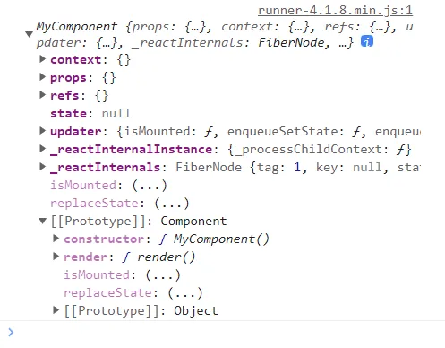
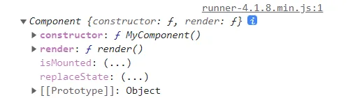
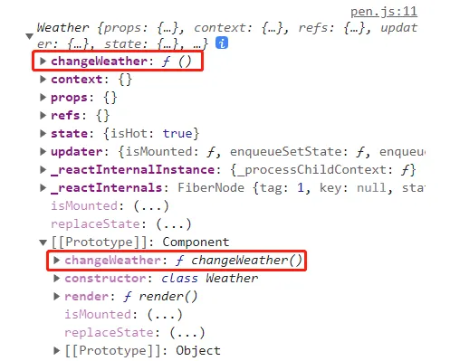
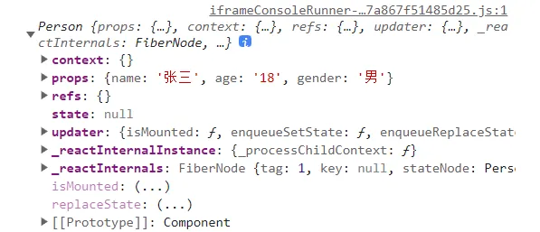
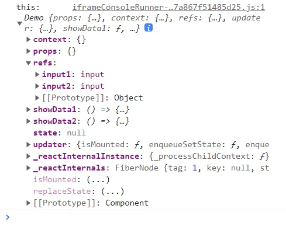
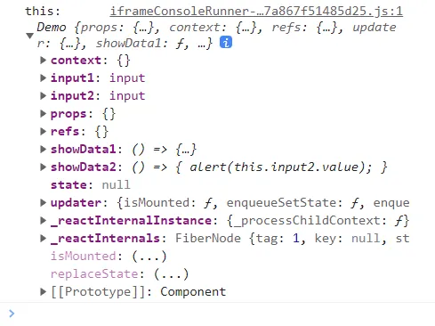
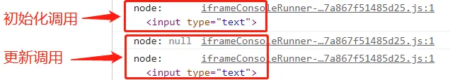
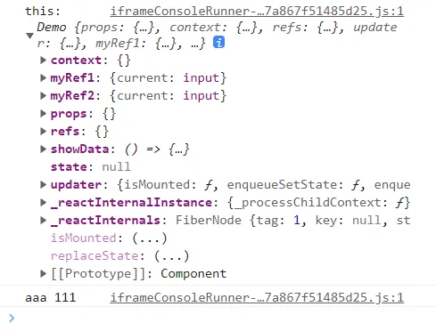

# React 组件

安装插件：React Developer Tools。

## 基本理解和使用

### 函数组件

```jsx
// 创建函数式组件
function MyComponent() {
  console.log(this)   // undefined
  return <h1>用函数定义的组件</h1>
}

// 渲染组件到页面
ReactDOM.render(<MyComponent />, document.getElementById('app'))
```

:::caution
- 函数（组件）名首字母要大写，且函数必须要有返回值。
- 渲染组件时必须写组件标签且必须闭合，不能只写组件（函数）的名字。
:::

**函数组件中的 this**

函数式组件中的 `this` 本来指向 `window`，但代码经过 Babel 编译后，开启了严格模式，所以 `this` 就不再指向 `window`，而是 `undefined`。

**React 做了什么**

执行 `ReactDOM.render(<MyComponent />, document.getElementById('app'))` 时：
1. React 解析组件标签，找到 MyComponent 组件。
2. 发现组件是用函数定义的，就调用该函数，将返回的虚拟 DOM 转为真实 DOM，渲染到页面中。

### 类组件

```jsx
// 创建类式组件
// 1. 必须继承 React.Component
class MyComponent extends React.Component {
  // 2. render 是必须写的
  //    render 函数在 MyComponent 的原型对象上，供实例对象使用
  render() {
    console.log(this)   // render 中的 this 指向 MyComponent 实例对象（组件实例对象）
    // 3. render 函数中的 return 是必须的
    return <h1>用类定义的组件</h1>
  }
}

console.log(MyComponent.prototype)

// 渲染组件到页面
ReactDOM.render(<MyComponent />, document.getElementById('app'))
```

**console.log(this)**

MyComponent 组件没有写 `constructor` 构造器，组件实例对象身上的 `context`、`props`、`refs`、`state` 等属性，都是从 `React.Component` 继承过来的。



**console.log(MyComponent.prototype)**

`render` 函数在组件的原型对象上，供实例对象使用。



**React 做了什么**

执行 `ReactDOM.render(<MyComponent />, document.getElementById('app'))` 时：
1. React 解析组件标签，找到 MyComponent 组件。
2. 发现组件是使用类定义的，就 new 出来该类的实例（实例是通过执行类内部的 `constructor` 得到的），并通过实例对象调用原型上的 `render` 方法。
3. 将 `render` 方法返回的虚拟 DOM 转为真实 DOM，渲染在页面上。

## 组件三大核心属性：state

### 基本使用

```jsx
class Weather extends React.Component {
  constructor(props) {
    super(props)
    this.state = { isHot: true }
  }

  // demo 方法在 Weather 类的原型对象上，供实例使用
  // 通过 Weather 实例对象调用 demo 时，demo 中的 this 就是 Weather 的实例对象
  demo() {
    console.log('111111')
  }

  render() {
    const { isHot } = this.state
    // 给元素添加 onClick 属性，绑定事件
    // this.demo 后面如果直接加上 ()，会直接调用 demo 函数
    return <h1 onClick={this.demo}>今天天气很{isHot ? '炎热' : '凉爽'}</h1>
  }
}
```

### this 指向问题

组件中的 `constructor` 和 `render` 方法中的 `this`，指向的都是组件实例对象。
- `constructor` 中的 `this` 指向的一定是实例对象。
- `render` 中的 `this` 指向组件实例对象是因为 React 发现组件是用类定义的，就帮我们 new 了该类，得到了该类的实例对象。

但组件中的自定义方法中的 `this`，指向的不是组件的实例对象，而是 `undefined`。

```jsx
class Weather extends React.Component {
  constructor(props) {
    super(props)
    this.state = { isHot: true }
  }

  // changeWeather 方法在 Weather 类的原型对象上，供实例使用
  // 通过 Weather 实例对象调用 changeWeather 时，changeWeather 中的 this 就是 Weather 实例对象
  // 但是此处，changeWeather 是作为 onClick 的回调直接调用的，而不是通过实例调用的
  // 相当于 changeWeather()，即：changeWeather.call(undefined)
  // 所以在浏览器中，this 指向 window
  // 又因为类中的方法默认开启了局部的严格模式，所以 this 就成了 undefined（与 Babel 无关）
  changeWeather() {
    console.log(this)   // undefined
  }

  render() {
    const { isHot } = this.state
    return <h1 onClick={this.changeWeather}>今天天气很{isHot ? '炎热' : '凉爽'}</h1>
  }
}
```

### 解决 this 指向问题

通过在 `constructor` 中手动地给自定义方法绑定 `this`，就可以将自定义方法中的 `this` 强制指定为类的实例对象。

```jsx
class Weather extends React.Component {
  constructor(props) {
    super(props)
    this.state = { isHot: true }
    // 通过 bind 方法手动给 changeWeather 方法绑定 this
    // bind 会返回新的函数，并且指定 this
    // 所以 this.changeWeather 就是一个新的函数，并且该函数的 this 是组件实例对象
    // 以此解决自定义函数中的 this 指向问题
    this.changeWeather = this.changeWeather.bind(this)
  }

  changeWeather() {
    console.log(this)   // Weather 实例对象
  }

  render() {
    const { isHot } = this.state
    return <h1 onClick={this.changeWeather}>今天天气很{isHot ? '炎热' : '凉爽'}</h1>
  }
}
```

以上代码，会生成两个 `changeWeather` 方法，其中自定义的 `changeWeather` 方法在类的原型对象上，`constructor` 中通过 `bind` 新生成的 `changeWeather` 方法在类的实例对象上。



:::tip 总结
自定义方法在类的原型对象上，只有 new 这个类，通过类的实例对象去调用原型对象上的自定义方法，自定义方法中的 `this` 才是类的实例对象。

但通常，我们调用自定义方法不是通过实例对象调用的，而是作为事件的回调函数调用，所以会导致自定义方法中的 `this` 指向 `undefined` 的问题。

解决方法：
- 在 `constructor` 中通过函数对象的 `bind` 方法强制绑定 `this`。
- 使用“赋值语句 + 箭头函数”的形式。
:::

### setState

状态不可直接更改，直接修改 `state` 中的数据，数据只会在内存中发生变化，而不会触发组件的重新渲染。

`React.Component` 类的原型上有个 `setState` 方法，用于修改 `state` 中的数据。

`setState` 方法修改数据后，会引起组件的重新渲染。

`setState` 方法要求传入一个对象，React 会拿着这个对象去与 `state` 对象做合并，而不是直接替换 `state` 对象。

```jsx
class Weather extends React.Component {
  constructor(props) {
    super(props)
    this.state = { isHot: true }
    this.changeWeather = this.changeWeather.bind(this)
  }

  changeWeather() {
    const { isHot } = this.state
    // 正确做法：通过从 React.Component 继承来的 setState 方法修改 state
    this.setState({ isHot: !isHot })

    // 错误做法：直接修改 state 中的数据
    // this.state.isHot = !isHot
  }

  render() {
    const { isHot } = this.state
    return <h1 onClick={this.changeWeather}>今天天气很{isHot ? '炎热' : '凉爽'}</h1>
  }
}
```

### 简写形式

类中可以写赋值语句，可以将属性或方法直接定义在实例对象自身。

这么做的好处是，可以省去构造器中的 `this` 的绑定，直接调用实例对象上的方法。

```jsx
class Weather extends React.Component {
  // state 会出现在实例对象自身
  state = { isHot: true }
  
  // changeWeather 也会在实例对象自身，而不在类的原型上
  // 注意，这里必须是箭头函数，不能是普通函数，否则 this 会丢失
  changeWeather = () => {
    console.log(this)   // Weather 实例对象
    const { isHot } = this.state
    this.setState({ isHot: !isHot })
  }
  
  render() {
    const { isHot } = this.state
    return (
      <h1 onClick={this.changeWeather}>
        今天天气很{isHot ? '炎热' : '凉爽'}
      </h1>
    )
  }
}
```

### 构造器与 render 方法会被调用几次

`constructor` 调用 1 次，`render` 调用 1 + n 次。
- React 在 new 组件类时，通过调用 `constructor`，生成组件实例对象，所以 `constructor` 会在初始化时调用 1 次。
- React 初次渲染页面时，通过组件实例对象调用 `render` 方法，所以 `render` 会在初始化时调用 1 次；当组件状态更新时会再次调用 `render`，重新渲染页面（只要状态发生变化，`render` 就会重新调用，从而更新页面）。

## 组件三大核心属性：props

### 基本使用

在组件标签上写的属性，都保存在组件实例对象的 `props` 属性中。

```jsx
class Person extends React.Component {
  render() {
  	console.log(this)
  	const { name, age, gender } = this.props
    return (
      <ul>
        <li>姓名：{name}</li>
        <li>年龄：{age}</li>
        <li>性别：{gender}</li>
      </ul>
    )
  }
}

ReactDOM.render(<Person name="张三" age="18" gender="男" />, document.getElementById('app1'))
ReactDOM.render(<Person name="李四" age="19" gender="女" />, document.getElementById('app2'))
ReactDOM.render(<Person name="王五" age="20" gender="男" />, document.getElementById('app3'))
```



:::caution
`props` 是只读的，组件内部不能对 `props` 中的属性进行修改，否则会报错。
:::

### 批量传递 props

```jsx title="使用对象的方式传递"
class Person extends React.Component {
  render() {
    const { name, age, gender } = this.props.info
    return (
      <ul>
        <li>姓名：{name}</li>
        <li>年龄：{age}</li>
        <li>性别：{gender}</li>
      </ul>
    )
  }
}

const person = { name: '张三', age: 18, gender: '男' }

ReactDOM.render(<Person info={person} />, document.getElementById('app'))
```

```jsx title="使用展开运算符方式传递"
class Person extends React.Component {
  render() {
    const { name, age, gender } = this.props
    return (
      <ul>
        <li>姓名：{name}</li>
        <li>年龄：{age}</li>
        <li>性别：{gender}</li>
      </ul>
    )
  }
}

const person = { name: '张三', age: 18, gender: '男' }

// {} 表示其中写的是 js 代码，并非表示一个对象
// ... 在 js 中不能直接展开一个对象，会报错，因为普通对象没有迭代器（可以直接展开一个数组）
// 但是由于引入了 React 和 Babel，所以在 React 中允许直接展开一个对象
// 但这种写法只适用于组件标签属性的传递，其他地方不能使用这种写法
ReactDOM.render(<Person {...person} />, document.getElementById('app'))
```

### 对 props 进行限制

要对 `props` 进行限制，需要引入“prop-types”库。

```html title="引入 prop-types 库"
<script src="https://cdn.bootcdn.net/ajax/libs/prop-types/15.8.1/prop-types.js"></script>
```

通过给类添加 `propTypes` 属性，可以限制属性的类型和是否必传；添加 `defaultProps` 属性，可以限制默认值。

```jsx
class Person extends React.Component {
  render() {
    const { name, age, gender } = this.props
    return (
      <ul>
        <li>姓名：{name}</li>
        <li>年龄：{age}</li>
        <li>性别：{gender}</li>
      </ul>
    )
  }
}

// 限制 props 的类型和是否必传
Person.propTypes = {
  // 引入 prop-types 库之后，全局就有了 PropTypes 对象
  name: PropTypes.string.isRequired,
  gender: PropTypes.string,
  age: PropTypes.number,
  speak: PropTypes.func,  // 函数要写成 func，而不是 function，因为 function 是 js 的关键字
}

// 限制 props 的默认值
Person.defaultProps = {
  gender: '男',
  age: 18
}

const person = {
  name: '张三',
  speak: () => {
    console.log('说话了')
  }
}

ReactDOM.render(<Person {...person} />, document.getElementById('app'))
```

:::caution
注意，React 15.5 之前的版本，`PropTypes` 对象内置在 React 中，可以直接使用。

```jsx
Person.propTypes = {
  name: React.PropTypes.string.isRequired,
  age: React.PropTypes.number
}
```

从 React 15.5 版本开始，React 就将 `PropTypes` 对象移出来单独封装成一个库，供开发者按需使用。
:::

```jsx title="对 props 的限制不应该写在组件外面，而应该写在组件里面"
class Person extends React.Component {
  // 使用 static 关键字，将 propTypes 与 defaultProps 定义在 Person 类自身
  static propTypes = {
    name: PropTypes.string.isRequired,
    age: PropTypes.number,
    gender: PropTypes.string
  }
  static defaultProps = {
    age: 18,
    gender: '男'
  }
  render() {
    const { name, age, gender } = this.props
    return (
      <ul>
        <li>姓名：{name}</li>
        <li>年龄：{age}</li>
        <li>性别：{gender}</li>
      </ul>
    )
  }
}
```

### 构造器与 props

类式组件中，构造器函数 `constructor` 可以写也可以不写，但是如果写了，那么构造器中的 `props` 就有点讲究。

```jsx
class Person extends React.Component {
  // 如果要在构造器中通过实例对象（this）访问 props
  // 那么必须接收 props，且必须传给 super
  // 否则 this.props 就是 undefined
  constructor(props) {
    super(props)
    console.log(props)        // 传进来的 props
    console.log(this.props)   // 实例对象身上的 props
    // 如果要在构造器函数中使用 props，直接使用传进来的 props 就可以了
    // props 与 this.props 的值是一样的
  }

  // 不接收 props 也可以，不会报错
  constructor() {
    super()
  }

  // 但是，如果在构造器中通过 this 访问 props
  // 且没有接收 props，或者接收了 props 却没有传递给 super
  // 那么通过实例访问的 props 就是 undefined
  constructor() {
    super()
    console.log(this.props)   // undefined
  }
}
```

总结：构造器是否接收 `props`，`props` 是否传递给 `super`，取决于是否要在构造器中通过实例对象（`this`）访问 `props`。

### 函数式组件与 props

函数式组件中，也可以使用 `props`，因为函数可以接收参数，但是不能使用 `state`、`refs`。

```jsx
// 组件标签上的属性，会作为函数的参数传递进来
function Person(props) {
  const { name, age, gender } = props
  return (
    <ul>
      <li>姓名：{name}</li>
      <li>年龄：{age}</li>
      <li>性别：{gender}</li>
    </ul>
  )
}

// 给函数式组件添加 props 限制
Person.propTypes = {
  name: PropTypes.string.isRequired,
  age: PropTypes.number,
  gender: PropTypes.string
}
Person.defaultProps = {
  age: 18,
  gender: '男'
}

const person = { name: '张三', age: 18, gender: '男' }
ReactDOM.render(<Person {...person} />, document.getElementById('app'))
```

## 组件三大核心属性：refs

### 字符串形式的 ref

```jsx
class Demo extends React.Component {
  showData1 = () => {
    console.log('this:', this)
    const { input1 } = this.refs
    alert(input1.value)
  }
  showData2 = () => {
    console.log('this:', this)
    const { input2 } = this.refs
    alert(input2.value)
  }
  render() {
    return (
      <div>
        {/* 字符串形式的 ref */}
        <input ref="input1" type="text" placeholder="点击按钮提示数据" />
        <button onClick={this.showData1}>click me</button>
        <br />
        {/* 字符串形式的 ref */}
        <input ref="input2" type="text" placeholder="失焦提示数据" onBlur={this.showData2} />
      </div>
    )
  }
}
```



:::caution
字符串形式的 `ref` 已经不被 React 推荐使用，因为它存在一些效率上的问题，在将来的 React 版本中可能会被移除。
:::

### 回调形式的 ref

```jsx
class Demo extends React.Component {
  showData1 = () => {
    console.log('this:', this)
    {/* 从实例对象身上的 input1 属性拿到对应的元素节点 */}
    alert(this.input1.value)
  }
  showData2 = () => {
    console.log('this:', this)
    {/* 从实例对象身上的 input2 属性拿到对应的元素节点 */}
    alert(this.input2.value)
  }
  render() {
    return (
      <div>
        {/* 在回调函数中，将当前元素节点赋值到实例对象身上的 input1 属性 */}
        <input ref={node => this.input1 = node} type="text" placeholder="点击按钮提示数据" />
        <button onClick={this.showData1}>click me</button>
        <br />
        {/* 在回调函数中，将当前元素节点赋值到实例对象身上的 input2 属性 */}
        <input ref={node => this.input2 = node} type="text" placeholder="失焦提示数据" onBlur={this.showData2} />
      </div>
    )
  }
}
```



### ref 回调函数执行次数

**内联形式**

ref 的内联形式的回调函数，会在页面初始化时调用一次，当数据更新重新调用 `render` 时，ref 的回调会被调用两次。

第一次传入参数 null，第二次才会传入参数 DOM 元素。这是因为在每次渲染时会创建一个新的函数实例，React 会清空旧的 ref 并且设置新的。

```jsx title="内联形式"
class Demo extends React.Component {
  state = { isHot: true }
  changeWeather = () => {
    const { isHot } = this.state
    this.setState({ isHot: !isHot })
  }
  
  render() {
    const { isHot } = this.state
    return (
      <>
        <h2>今天天气很{isHot ? '炎热' : '凉爽'}</h2>
        <button onClick={this.changeWeather}>切换天气</button>
        <br /><br />
        <input ref={(node) => {
          this.input1 = node
          console.log('node:', node)
        }} type="text" />
      </>
    )
  }
}
```



**绑定形式**

ref 的 class 绑定形式的函数，只会在页面初始化时调用一次，当数据更新重新调用 `render` 时不会再次调用该函数。

```jsx title="class 绑定形式"
class Demo extends React.Component {
  state = { isHot: true }
  changeWeather = () => {
    const { isHot } = this.state
    this.setState({ isHot: !isHot })
  }
  saveInput = (node) => {
    console.log('node:', node)
    this.input1 = node
  }

  render() {
    const { isHot } = this.state
    return (
      <>
        <h2>今天天气很{isHot ? '炎热' : '凉爽'}</h2>
        <button onClick={this.changeWeather}>切换天气</button>
        <br /><br />
        <input ref={this.saveInput} type="text" />
      </>
    )
  }
}
```


:::tip
内联形式与 class 绑定形式的区别主要在于回调函数的调用次数上，大多数时候它是无关紧要的，优先还是使用内联形式。
:::

### createRef

`React.createRef()` 会返回一个容器，该容器可以存储被 `ref` 所标识的节点。

```jsx
class Demo extends React.Component {
  // ref 容器需要放在组件实例对象自身
  myRef1 = React.createRef()
  myRef2 = React.createRef()
  
  showData = () => {
    console.log('this:', this)
    const { myRef1, myRef2 } = this
    console.log(myRef1.current.value, myRef2.current.value)
  }

  render() {
    return (
      <>
        <input ref={this.myRef1} type="text" />
        <input ref={this.myRef2} type="text" />
        <button onClick={this.showData}>click me</button>
      </>
    )
  }
}
```



注意，一个 ref 容器只能存储一个元素，如果往同一个 ref 容器中放入多个元素，那么最后放入的那个元素会覆盖之前的元素。

## 事件处理

通过 `onXxx` 形式指定事件处理函数。

- React 使用的是自定义（合成）事件，而不是原生 DOM 事件，这是为了更好的兼容性。
- React 中的事件是通过事件委托方式处理的，委托给组件最外层元素，这是为了高效。

通过 `event.target` 可以得到发生事件的 DOM 元素对象，而**不要过度使用 `ref` 获取元素**。

### React 中的事件委托

以下代码，给 input 和 button 绑定的事件，都会被 React 添加到最外层的 div 身上。

```jsx
class Demo extends React.Component {
  render() {
    return (
      <div>
        <input ref={this.myRef1} type="text" onInput={this.onInput} />
        <input ref={this.myRef2} type="text" onBlur={this.onBlur} />
        <button onClick={this.showData}>click me</button>
      </div>
    )
  }
}
```

### React 中的 event.target

React 在触发 DOM 元素的事件回调时，会默认将触发事件的 DOM 元素对象传给事件回调函数。

```jsx
class Demo extends React.Component {
  onBlur = (event) => {
    console.log('event', event)
  }

  render() {
    return (
      <div>
        <input type="text" onBlur={this.onBlur} />
      </div>
    )
  }
}
```
