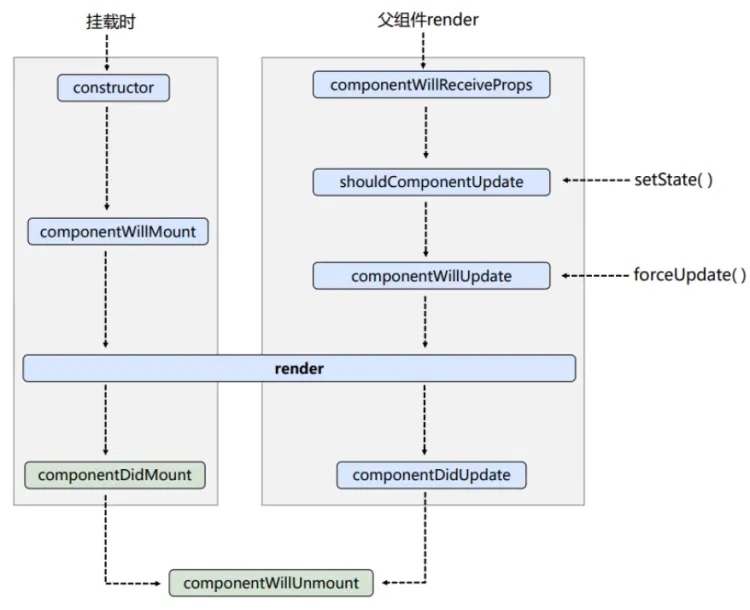
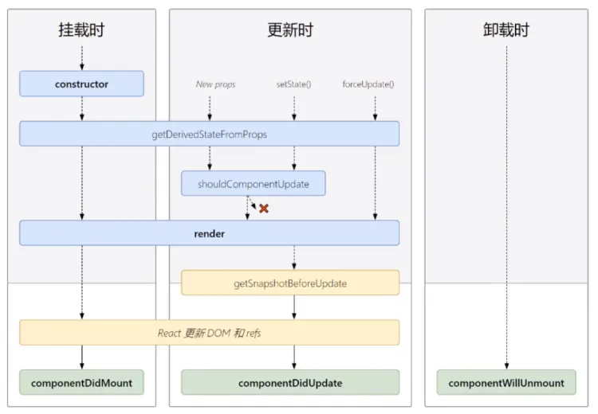

# React 生命周期

## 生命周期流程（旧）

下图中，左侧为组件挂载的流程，右侧为组件更新的流程。



**初始化阶段（初次渲染）**

```text title="由 ReactDOM.render() 触发"
constructor() -> componentWillMount() -> render() -> componentDidMount()
```

**更新阶段**

```text title="组件内部调用 setState() 触发"
shouldComponentUpdate() -> componentWillUpdate() -> render() -> componentDidUpdate()
```

```text title="组件内部调用 forceUpdate() 触发"
componentWillUpdate() -> render() -> componentDidUpdate()
```

```text title="父组件重新 render 触发"
componentWillReceiveProps -> shouldComponentUpdate() ->
componentWillUpdate() -> render() -> componentDidUpdate()
```

**卸载阶段**

```text title="由 ReactDOM.unmountComponentAtNode() 触发"
componentWillUnmount()
```

### shouldComponentUpdate

`shouldComponentUpdate()` 是用于控制组件更新的“阀门”，如果没写这个钩子函数，那么默认返回值为 `true`，如果写了这个钩子函数，返回值必须是布尔值，不能是其他值。

```jsx
class Demo extends React.Component {
  shouldComponentUpdate() {
    return true  // 默认值
  }

  shouldComponentUpdate() {
    return false  // 调用 setState 时，组件更新流程至此中断，组件将不被更新
  }
}
```

### forceUpdate

`forceUpdate()` 是强制更新，它不受 `shouldComponentUpdate()` 约束。

如果想让组件更新，但不希望改变 state，就可以使用 `forceUpdate()`。

```jsx
class Count extends React.Component {
  // 控制组件更新的阀门
  shouldComponentUpdate() {
    return false
  }
  
  force = () => {
    this.forceUpdate()
  }

  render() {
    console.log('render')
    const { sum } = this.state
    return (
      <div>
        <button onClick={this.force}>强制更新组件</button>
      </div>
    )
  }
}
```

### componentWillReceiveProps

当父组件数据更新，重新 render 时，子组件就会触发 `componentWillReceiveProps` 钩子，接收新的 props。

```jsx title="父组件"
class Parent extends React.Component {
  state = { carName: '奔驰' }
  
  changeCar = () => {
    this.setState({ carName: '奥迪' })
  }

  render() {
    const { carName } = this.state
    return (
      <div style={{ border: '1px solid red', padding: '10px' }}>
        <h2>父组件</h2>
        <button onClick={this.changeCar}>换车</button>
        <Child carName={carName} />
      </div>
    )
  }
}
```

```jsx title="子组件"
class Child extends React.Component {
  componentWillReceiveProps(props) {
    // props 是新的参数
    console.log('componentWillReceiveProps', props)
  }

  shouldComponentUpdate() {
    return true
  }

  render() {
    const { carName } = this.props
    return (
      <div style={{ border: '1px solid green', marginTop: '10px' }}>
        <p>{carName}</p>
        <h3>子组件</h3>
      </div>
    )
  }
}
```

:::caution
父组件重新 render 时，子组件才会执行更新流程的钩子，初次渲染时不会执行。
:::

## 生命周期流程（新）



**初始化阶段（初次渲染）**

```text title="由 ReactDOM.render() 触发"
constructor() -> getDerivedStateFromProps() -> render() -> componentDidMount()
```

**更新阶段**

```text title="组件内部调用 setState() 触发"
getDerivedStateFromProps() -> shouldComponentUpdate() -> render() -> getSnapshotBeforeUpdate() -> componentDidUpdate()
```

```text title="组件内部调用 forceUpdate() 触发"
getDerivedStateFromProps() -> render() -> getSnapshotBeforeUpdate() -> componentDidUpdate()
```

```text title="父组件重新 render 触发"
getDerivedStateFromProps() -> shouldComponentUpdate() -> render() -> getSnapshotBeforeUpdate() -> componentDidUpdate()
```

**卸载阶段**

```text title="由 ReactDOM.unmountComponentAtNode() 触发"
componentWillUnmount()
```

### getDerivedStateFromProps

`getDerivedStateFromProps` 意思是从 props 中获取“派生”状态。

注意，它是一个静态方法，不能定义成实例方法。且必须 return 一个状态对象或 `null`，否则会报错。

```jsx
class Count extends React.Component {
  state = { sum: 0 }

  // 从 props 获取派生 state
  static getDerivedStateFromProps(props, state) {
    console.log('this:', this)		// this 是 undefined
    console.log('props:', props)	// props 是组件外部传进来的 props
    console.log('state:', state)	// state 是组件内部的 state
    return props	// 将 props 的值作为 state 供组件使用
  }

  render() {
    return (
      <div>
        {/* 这里的 sum 就是 200 */}
        <h2>当前求和为：{this.state.sum}</h2>
      </div>
    )
  }
}

ReactDOM.render(<Count sum={200} />, document.getElementById('root'))
```

:::caution
- 这个钩子适用于及其罕见的案例，即 `state` 的值在任何时候都取决于 `props`。
- 派生状态会导致代码冗余，并使组件难以维护。
:::

### getSnapshotBeforeUpdate

`getSnapshotBeforeUpdate()` 在最近一次渲染输出（提交到 DOM 节点）之前调用。

- 它使得组件能在发生更改之前从 DOM 中捕获一些信息（例如滚动位置）。
- 此生命周期的任何返回值将作为参数传递给 `componentDidUpdate()`。
- 此用法并不常见，但它可能出现在 UI 处理中，如需要以特殊方式处理滚动位置的聊天线程等。
- 应返回 snapshot（任何值都可以作为 snapshot 值）的值或 `null`。

```jsx title="getSnapshotBeforeUpdate 案例"
class NewsList extends React.Component {
  state = { newsArr: [] }

  componentDidMount() {
    setInterval(() => {
      const { newsArr } = this.state
      const news = '新闻' + (newsArr.length + 1)
      this.setState({ newsArr: [news, ...newsArr] })
    }, 1000)
  }

  // 在更新之前获取快照
  // 接收之前的 props 和 state 作为参数
  // 返回值会传递给 componentDidUpdate
  getSnapshotBeforeUpdate(preProps, preState) {
    console.log('getSnapshotBeforeUpdate')
    return this.listNode.scrollHeight
  }

  // 组件已经更新
  // 接收之前的 props 和 state 作为参数，snapshot 为 getSnapshotBeforeUpdate 的返回值
  componentDidUpdate(preProps, preState, snapshot) {
    console.log('componentDidUpdate')
    this.listNode.scrollTop += this.listNode.scrollHeight - snapshot
  }

  render() {
    const { newsArr } = this.state
    return (
      <div ref={node => this.listNode = node} className="list">
        {
          newsArr.map((news, index) => {
            return <div key={index} className="news">{news}</div>
          })
        }
      </div>
    )
  }
}
```

### 使用旧的生命周期钩子

在新版 React 中使用以下旧的生命周期钩子，控制台会有警告。要解决这些警告，可以在钩子前加上 `UNSAFE_` 前缀。

```jsx
class Demo extends React.Component {
  UNSAFE_componentWillMount() {
    console.log('componentWillMount')
  }
  UNSAFE_componentWillUpdate() {
    console.log('componentWillUpdate')
  }
  UNSAFE_componentWillReceiveProps(props) {
    console.log('componentWillReceiveProps', props)
  }
}
```

在 React 18 版本中，只有写了 `UNSAFE_` 前缀，这些钩子才能正常工作。

:::warning
这些需要加 `UNSAFE_` 前缀的生命周期钩子即将过时，在新版本 React 中可能会出现 bug（尤其是在启用异步渲染之后），故应该避免使用。
:::
