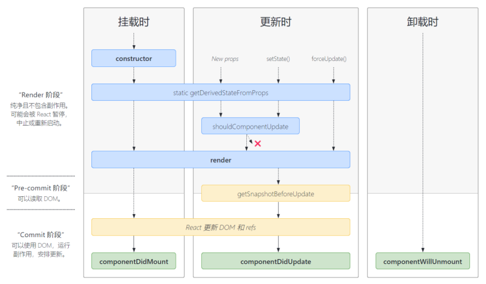

:::tip
函数组件没有生命周期。
:::

## 生命周期流程



### 初始化阶段（初次渲染）

```text title="由组件首次 render 触发"
constructor() -> getDerivedStateFromProps() -> render() -> componentDidMount()
```

### 更新阶段

```text title="组件内部调用 setState() 触发"
getDerivedStateFromProps() -> shouldComponentUpdate() -> render() -> getSnapshotBeforeUpdate() -> componentDidUpdate()
```

```text title="组件内部调用 forceUpdate() 触发"
getDerivedStateFromProps() -> render() -> getSnapshotBeforeUpdate() -> componentDidUpdate()
```

```text title="父组件重新 render 触发"
getDerivedStateFromProps() -> shouldComponentUpdate() -> render() -> getSnapshotBeforeUpdate() -> componentDidUpdate()
```

### 卸载阶段

```text title="由 ReactDOM.unmountComponentAtNode() 触发"
componentWillUnmount()
```

## getDerivedStateFromProps

`getDerivedStateFromProps` 意思是从 props 中获取“派生”状态。

注意，它是一个静态方法，不能定义成实例方法。且必须 return 一个状态对象或 `null`，否则会报错。

```jsx
class Count extends React.Component {
  state = { sum: 0 }

  // 从 props 获取派生 state
  static getDerivedStateFromProps(props, state) {
    console.log('this:', this)		// this 是 undefined
    console.log('props:', props)	// props 是组件外部传进来的 props
    console.log('state:', state)	// state 是组件内部的 state
    return props	// 将 props 的值作为 state 供组件使用
  }

  render() {
    return (
      <div>
        {/* 这里的 sum 就是 200 */}
        <h2>当前求和为：{this.state.sum}</h2>
      </div>
    )
  }
}

ReactDOM.render(<Count sum={200} />, document.getElementById('root'))
```

:::caution
- 这个钩子适用于及其罕见的案例，即 `state` 的值在任何时候都取决于 `props`。
- 派生状态会导致代码冗余，并使组件难以维护。
:::

## shouldComponentUpdate

`shouldComponentUpdate` 钩子在组件更新之前触发，它返回一个布尔值，用于控制组件是否可以更新。

如果没写这个钩子，默认返回 `true`，表示组件可以更新。

```jsx
class Demo extends React.Component {
  shouldComponentUpdate() {
    return false  // 调用 setState 时，组件更新流程至此中断，组件将不被更新
  }
}
```

`shouldComponentUpdate` 接收两个参数：`nextProps`、`nextState`，分别表示组件即将接收的新属性和新状态。通过对比新属性、新状态与当前属性、当前状态，可以决定组件是否需要更新。

```jsx
class Count extends React.Component {
  state = { sum: 0 }

  shouldComponentUpdate(nextProps, nextState) {
    // 只有当 sum 发生变化时才更新组件
    return nextState.sum !== this.state.sum
  }

  add = () => {
    this.setState({ sum: this.state.sum + 1 })
  }

  render() {
    const { sum } = this.state
    return (
      <div>
        <h2>当前求和为：{sum}</h2>
        <button onClick={this.add}>加一</button>
      </div>
    )
  }
}
```

## getSnapshotBeforeUpdate

`getSnapshotBeforeUpdate()` 在最近一次渲染输出（提交到 DOM 节点）之前调用。

- 它使得组件能在发生更改之前从 DOM 中捕获一些信息（例如滚动位置）。
- 此生命周期的任何返回值将作为参数传递给 `componentDidUpdate()`。
- 此用法并不常见，但它可能出现在 UI 处理中，如需要以特殊方式处理滚动位置的聊天线程等。
- 应返回 snapshot（任何值都可以作为 snapshot 值）的值或 `null`。

```jsx title="getSnapshotBeforeUpdate 案例"
class NewsList extends React.Component {
  state = { newsArr: [] }

  componentDidMount() {
    setInterval(() => {
      const { newsArr } = this.state
      const news = '新闻' + (newsArr.length + 1)
      this.setState({ newsArr: [news, ...newsArr] })
    }, 1000)
  }

  // 在更新之前获取快照
  // 接收之前的 props 和 state 作为参数
  // 返回值会传递给 componentDidUpdate
  getSnapshotBeforeUpdate(preProps, preState) {
    console.log('getSnapshotBeforeUpdate')
    return this.listNode.scrollHeight
  }

  // 组件已经更新
  // 接收之前的 props 和 state 作为参数，snapshot 为 getSnapshotBeforeUpdate 的返回值
  componentDidUpdate(preProps, preState, snapshot) {
    console.log('componentDidUpdate')
    this.listNode.scrollTop += this.listNode.scrollHeight - snapshot
  }

  render() {
    const { newsArr } = this.state
    return (
      <div ref={node => this.listNode = node} className="list">
        {
          newsArr.map((news, index) => {
            return <div key={index} className="news">{news}</div>
          })
        }
      </div>
    )
  }
}
```

## forceUpdate

`forceUpdate()` 是强制更新，它不受 `shouldComponentUpdate()` 约束。

如果想让组件更新，但不希望改变 state，就可以使用 `forceUpdate()`。

```jsx
class Count extends React.Component {
  // 控制组件更新的阀门
  shouldComponentUpdate() {
    return false
  }

  force = () => {
    this.forceUpdate()
  }

  render() {
    console.log('render')
    const { sum } = this.state
    return (
      <div>
        <button onClick={this.force}>强制更新组件</button>
      </div>
    )
  }
}
```

## PureComponent

`setState` 存在两个不合理之处：

- `setState` 无论是否更新了 state，`render` 函数都会重新调用，触发组件重新渲染。
- 当父组件更新，无论子组件有没有用到父组件的数据，子组件都会被重新渲染。

传统解决方案是，在 `shouldComponentUpdate` 钩子中判断 props 和 state 是否有变化，从而决定是否更新组件。

```jsx title="传统解决方案"
class Count extends React.Component {
  shouldComponentUpdate(nextProps, nextState) {
    if (nextProps.count !== this.props.count) {
      return true
    }
    if (nextState.count !== this.state.count) {
      return true
    }
    return false
  }
}
```

但这仅仅是一个属性的比较，如果 props 或者 state 中有多个属性，这种方式就很麻烦。

自 React 16.3 开始，可以使用 PureComponent 来解决这个问题。它会自动对 props 和 state 进行浅层对比，只有 props 或 state
发生变化，组件才会重新渲染。这样可以减少手动编写 `shouldComponentUpdate` 钩子。

```jsx title="使用 PureComponent"
class Count extends React.PureComponent {
  // 与之前写法相同，但不⽤写 shouldComponentUpdate 了，会⾃动帮我们判断
}
```

`React.Component` 与 `React.PureComponent` 的区别：

- `React.Component` 没有实现 `shouldComponentUpdate`，需要手动编写。
- `React.PureComponent` 以浅层对比 props 和 state 的方式来实现 `shouldComponentUpdate`。

注意，`React.PureComponent` 中的 `shouldComponentUpdate` 仅作对象的浅层比较。如果对象中包含复杂的数据结构，则可能因为无法检查深层的差别，产生错误的对比结果。

所以，仅在 props 和 state 较为简单时，才使⽤ `React.PureComponent`，或者在深层数据结构发生变化时，手动调⽤ `forceUpdate()` 来更新组件。

## 使用旧的生命周期钩子

在新版 React 中使用以下旧的生命周期钩子，控制台会有警告。要解决这些警告，可以在钩子前加上 `UNSAFE_` 前缀。

```jsx
class Demo extends React.Component {
  UNSAFE_componentWillMount() {
    console.log('componentWillMount')
  }

  UNSAFE_componentWillUpdate() {
    console.log('componentWillUpdate')
  }

  UNSAFE_componentWillReceiveProps(props) {
    console.log('componentWillReceiveProps', props)
  }
}
```

在 React 18 版本中，只有写了 `UNSAFE_` 前缀，这些钩子才能正常工作。

:::warning
这些需要加 `UNSAFE_` 前缀的生命周期钩子即将过时，在新版本 React 中可能会出现 bug（尤其是在启用异步渲染之后），故应该避免使用。
:::
