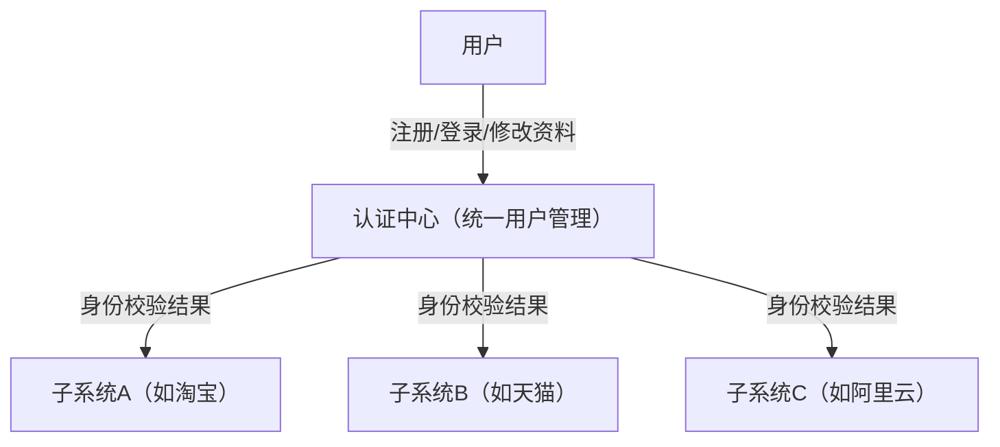
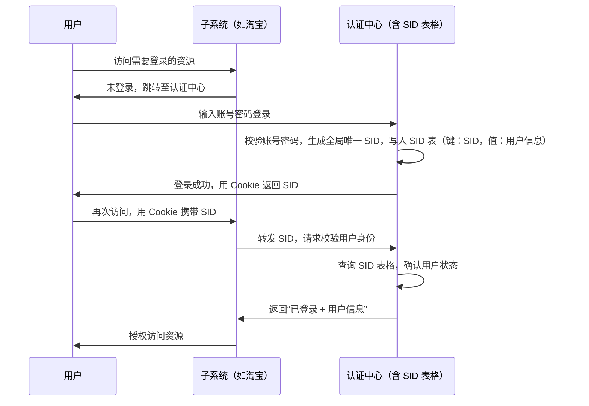
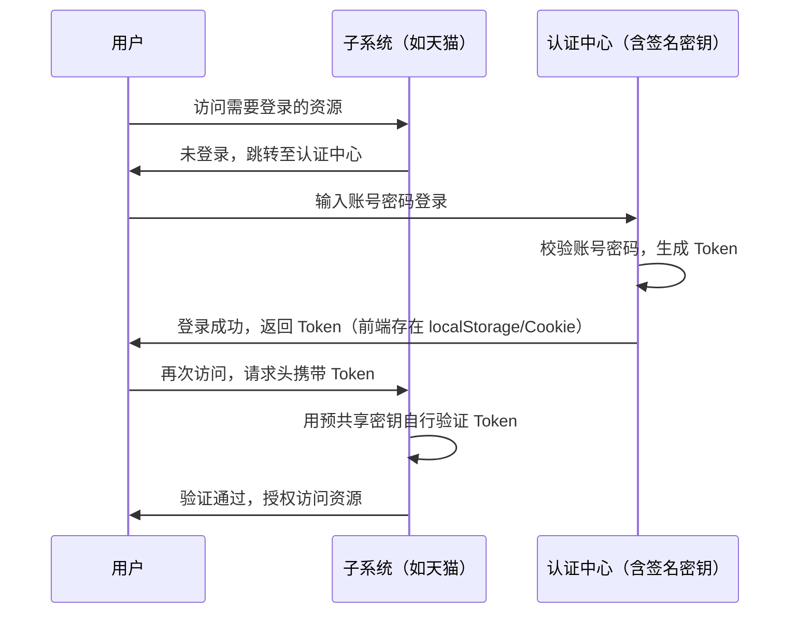
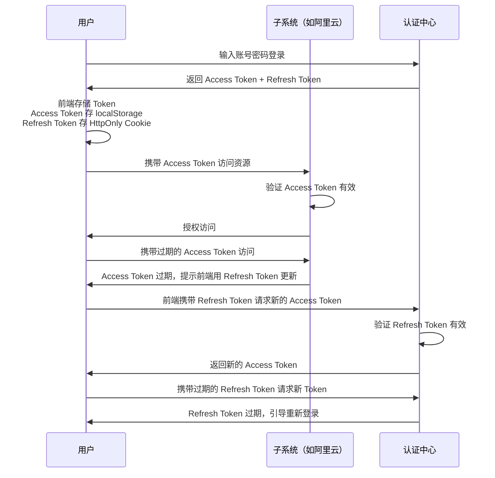

# 单点登录（SSO）

**单点登录**：在一个企业/平台的多套子系统中（如淘宝、天猫），用户只需在**统一认证中心**完成一次登录，就可以访问所有子系统，无需重复登录。

**核心价值**：
- 解决“多系统重复登录”的用户体验问题；
- 统一管理用户信息（注册、登录、资料修改均在认证中心完成），避免子系统各自维护用户体系的冗余。

**实现前提**：需抽离出独立的**认证中心**，统一管理用户身份信息，子系统不存储用户信息，而是通过认证中心确认身份。

SSO 的实现方案主要有两种：**SID + Cookie 模式** 和 **Token 模式**。

## SID + Cookie 模式

核心原理：认证中心维护一张“**SessionID 表**”（存储全局唯一 ID 与用户身份的映射），前端用 Cookie 携带 SessionID 到子系统，子系统通过 SessionID 向认证中心校验用户身份。

:::tip SID 表
- 存储位置：可存于数据库（持久化）或内存（高性能，如 Redis）；
- 时效性：每条记录有过期时间（如 2 小时），过期后自动删除，避免无效数据堆积。
:::

| 优点                            | 缺点                                   |  
|-------------------------------|--------------------------------------|  
| 认证中心**控制力强**：可实时删除 SID 强制用户下线 | 认证中心**压力大**：子系统每次校验都需请求认证中心，高并发场景需扩容 |  
| 安全性高：SID 仅为“索引”，不携带用户信息，泄露风险低 | 成本高：需搭建认证中心集群+容灾系统，子系统扩容需要认证中心同步扩容   |  

## Token 模式

核心原理：认证中心不存储用户状态，而是生成一个**不可篡改的 Token**（如 JWT 格式）发送给用户，子系统通过“预共享密钥”自行验证 Token 有效性，无需依赖认证中心。

| 优点                                | 缺点                                        |  
|-----------------------------------|-------------------------------------------|  
| 认证中心**压力小**：无需存储用户状态，仅负责生成 Token  | 认证中心**控制力弱**：Token 有效期内无法强制下线（需通知所有子系统拉黑） |  
| 成本低：无需搭建认证中心集群，子系统扩容不影响认证中心       | 安全性依赖密钥：若子系统密钥泄露，可能导致 Token 伪造            |  
| 分布式友好：支持跨域、跨端（APP/Web），Token 传递灵活 | Token 过期需重新登录                             |  

## 综合优化方案：双 Token 模式

结合“**SID + Cookie 模式的控制力**”与“**Token 模式的低压力**”，解决单一模式的痛点。

核心原理，同时生成两种 Token：

- **Access Token**：有效期短（如 10 分钟），子系统可自行验证，用于日常接口访问；
- **Refresh Token**：有效期长（如 7 天），仅认证中心可识别，用于 Access Token 过期后获取新的 Token。

核心优势：

- 平衡控制力：认证中心可通过“拒绝刷新 Token”强制用户下线（如违规用户，下次刷新时返回失效）；
- 降低压力：仅 Token 过期时请求认证中心，减少认证中心请求量；
- 用户体验：用户无需频繁登录，仅 Refresh Token 过期时需重新登录。
