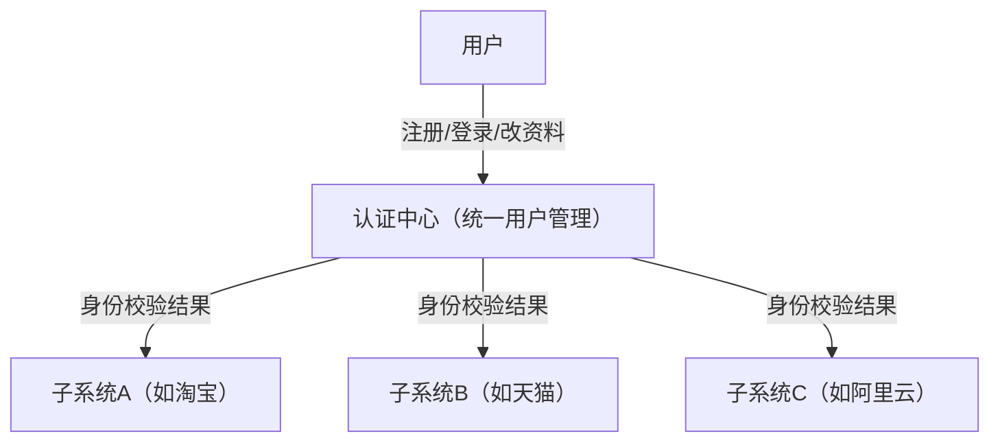
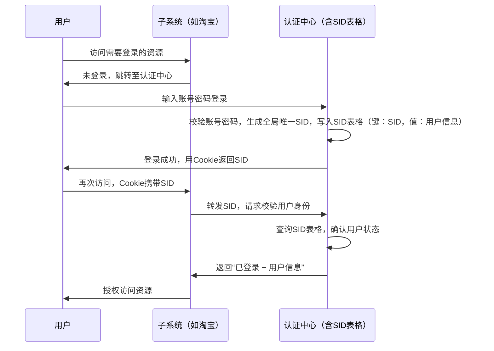
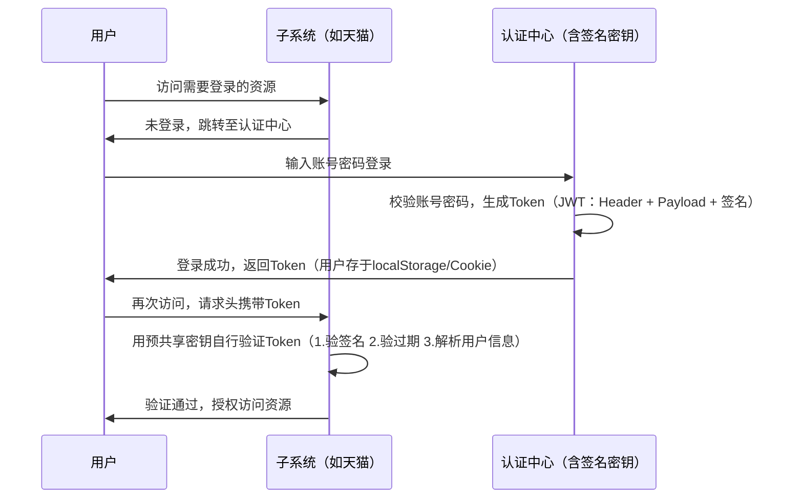
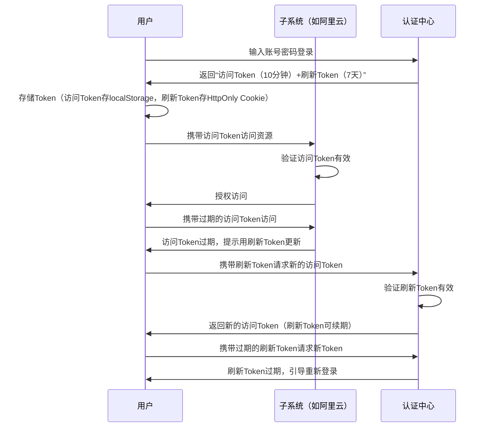

# 单点登录（SSO）

单点登录：在一个企业/平台的多套子系统中（如淘宝、天猫），用户只需在**统一认证中心**完成一次登录，就可以访问所有子系统，无需重复登录。

核心价值：
- 解决“多系统重复登录”的用户体验问题；
- 统一管理用户信息（注册、登录、资料修改均在认证中心完成），避免子系统各自维护用户体系的冗余。

实现前提：需抽离出独立的**认证中心**，作为用户身份的统一管理入口，子系统不存储用户信息，仅通过认证中心确认身份。

```mermaid
flowchart TD
    A[用户] -->|注册/登录/改资料| B[认证中心（统一用户管理）]
    B -->|身份校验结果| C[子系统A（如淘宝）]
    B -->|身份校验结果| D[子系统B（如天猫）]
    B -->|身份校验结果| E[子系统C（如阿里云）]
    %% 注：子系统不存储用户数据，仅依赖认证中心校验
```

SSO 的实现模式分为“标准模式（如OAuth2）”和“非标模式（企业自定义）”，但技术层面主要落地为两种方案：**SID+Cookie模式** 和 **Token模式**。

## SID + Cookie 模式

核心原理：通过认证中心维护一张“**SID表格**”（存储全局唯一ID与用户身份的映射），用Cookie携带SID，子系统通过SID向认证中心校验用户身份。

```mermaid
sequenceDiagram
    participant User as 用户
    participant SubTaobao as 子系统（如淘宝）
    participant Auth as 认证中心（含SID表格）

    User->>SubTaobao: 访问需要登录的资源
    SubTaobao->>User: 未登录，跳转至认证中心
    User->>Auth: 输入账号密码登录
    Auth->>Auth: 校验账号密码，生成全局唯一SID，写入SID表格（键：SID，值：用户信息）
    Auth->>User: 登录成功，用Cookie返回SID
    User->>SubTaobao: 再次访问，Cookie携带SID
    SubTaobao->>Auth: 转发SID，请求校验用户身份
    Auth->>Auth: 查询SID表格，确认用户状态
    Auth->>SubTaobao: 返回“已登录 + 用户信息”
    SubTaobao->>User: 授权访问资源
```

:::tip SID表格补充说明
- 存储位置：可存于数据库（持久化）或内存（高性能，如Redis）；
- 时效性：每条记录有过期时间（如2小时），过期后自动删除，避免无效数据堆积。
:::

| 优点                             | 缺点                                        |  
|--------------------------------|-------------------------------------------|  
| 认证中心**控制力极强**：可实时删除SID记录强制用户下线 | 认证中心**压力大**：子系统每次校验都需请求认证中心，高并发（千万级在线）需扩容 |  
| 安全性高：SID仅为“索引”，不携带用户信息，泄露风险低   | 成本高：需搭建认证中心集群+容灾系统，子系统扩容倒逼认证中心同步扩容        |  

## Token 模式

核心原理：认证中心不存储用户状态，而是生成一个**不可篡改的Token**（如JWT格式）发送给用户，子系统通过“预共享密钥”自行验证Token有效性，无需依赖认证中心。

```mermaid
sequenceDiagram
    participant User as 用户
    participant SubTmall as 子系统（如天猫）
    participant Auth as 认证中心（含签名密钥）

    User->>SubTmall: 访问需要登录的资源
    SubTmall->>User: 未登录，跳转至认证中心
    User->>Auth: 输入账号密码登录
    Auth->>Auth: 校验账号密码，生成Token（JWT：Header + Payload + 签名）
    Auth->>User: 登录成功，返回Token（用户存于localStorage/Cookie）
    User->>SubTmall: 再次访问，请求头携带Token
    SubTmall->>SubTmall: 用预共享密钥自行验证Token（1.验签名 2.验过期 3.解析用户信息）
    SubTmall->>User: 验证通过，授权访问资源
```

| 优点                                | 缺点                                       |  
|-----------------------------------|------------------------------------------|  
| 认证中心**压力极小**：无需存储用户状态，仅负责生成 Token | 认证中心**控制力弱**：Token有效期内无法强制下线（需通知所有子系统拉黑） |  
| 成本低：无需搭建认证中心集群，子系统扩容不影响认证中心       | 安全性依赖密钥：若子系统密钥泄露，可能导致Token伪造             |  
| 分布式友好：支持跨域、跨端（APP/Web），Token传递灵活  | Token过期需重新登录（或额外设计刷新逻辑）                  |  

## 综合优化方案：双 Token 模式

双 Token 需在 SSO 环境中才有意义，核心是结合“SID+Cookie的控制力”与“Token的低压力”，解决单一模式的痛点。

核心原理，同时生成两种Token：
- **访问Token（Access Token）**：短有效期（如10分钟），子系统可自行验证，用于日常接口访问；
- **刷新Token（Refresh Token）**：长有效期（如7天），仅认证中心可识别，用于“访问Token过期后重新获取新Token”。

```mermaid
sequenceDiagram
    participant User as 用户
    participant SubAliyun as 子系统（如阿里云）
    participant Auth as 认证中心

    %% 1. 首次登录，获取双Token
    User->>Auth: 输入账号密码登录
    Auth->>User: 返回“访问Token（10分钟）+刷新Token（7天）”
    User->>User: 存储Token（访问Token存localStorage，刷新Token存HttpOnly Cookie）

    %% 2. 日常访问，子系统自行验证访问Token
    User->>SubAliyun: 携带访问Token访问资源
    SubAliyun->>SubAliyun: 验证访问Token有效
    SubAliyun->>User: 授权访问

    %% 3. 访问Token过期，用刷新Token获取新Token
    User->>SubAliyun: 携带过期的访问Token访问
    SubAliyun->>User: 访问Token过期，提示用刷新Token更新
    User->>Auth: 携带刷新Token请求新的访问Token
    Auth->>Auth: 验证刷新Token有效
    Auth->>User: 返回新的访问Token（刷新Token可续期）

    %% 4. 刷新Token过期，需重新登录
    User->>Auth: 携带过期的刷新Token请求新Token
    Auth->>User: 刷新Token过期，引导重新登录
```

核心优势：
- 平衡控制力：认证中心可通过“拒绝刷新Token”强制用户下线（如违规用户，下次刷新时返回失效）；
- 降低压力：仅Token过期时请求认证中心，减少认证中心请求量；
- 兼顾体验：用户无需频繁登录，仅刷新Token过期时需重新操作。
