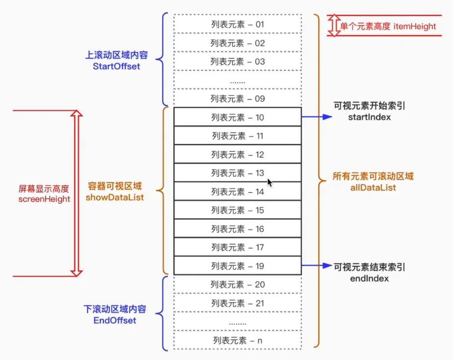

# 长列表虚拟滚动

场景与痛点：长列表一次性渲染成千上万个 DOM 节点，会极大消耗 CPU/GPU/内存，出现页面加载缓慢、滑动卡顿甚至崩溃。

## 虚拟滚动关键思路

核心思路：不直接把长列表数据一次性全部渲染到页面，而是动态截取长列表数据的一部分，展示到可视区域。

**如何截取？**

根据容器可视高度计算可容纳的元素数量，从长列表截取对应长度的子列表来展示。

**从哪里开始截取？**

监听滚动事件，根据滚动条的 `scrollTop`，除以每一项的高度，可计算出滚走了多少项以及新的起始索引，从 `startIndex` 开始截取。

**上下不可视部分如何处理？**

不可视部分用顶部、底部空白占位（`padding`）撑起高度，以此保持滚动条长度，营造“完整列表”错觉。
滚动时，需动态调整空白占位高度，确保滚动过程中上下内容衔接顺滑。



## 示例代码

:::code-group

```vue [Vue3]
<template>
  <div
    style="display: grid; gap: 12px; height: 100vh; padding: 16px;"
    class="page"
  >
    <header class="toolbar">
      <button @click="reset">重置滚动</button>
      <span>可视区展示 {{ visibleList.length }} / {{ dataList.length }} 条</span>
    </header>
    <!-- 虚拟滚动容器，监听滚动事件，更新数据展示 -->
    <div
      ref="scrollContainer"
      style="flex: 1; overflow-y: auto; padding: 0 12px;"
      class="scroll-container"
      @scroll.passive="onScroll"
    >
      <!-- 用 padding 占位，撑开滚动条高度 -->
      <div
        :style="{
          paddingTop: `${topBlankFill}px`,
          paddingBottom: `${bottomBlankFill}px`,
        }"
      >
        <!-- 可视区域展示的数据 -->
        <article
          v-for="item in visibleList"
          :key="item.id"
          style="padding: 12px 4px;"
          class="item"
        >
          <h4>{{ item.title }}</h4>
          <p>{{ item.desc }}</p>
        </article>
      </div>
    </div>
  </div>
</template>

<script setup lang="ts">
import { computed, onMounted, onUnmounted, ref } from 'vue'

// 原始长列表数据，真实业务可替换为接口返回的结果
// 也可通过后端接口分页/懒加载，分批拉取数据并写入 dataList，避免一次性占用过多内存
const dataList = ref(
  Array.from({ length: 10000 }, (_, idx) => ({
    id: idx,
    title: `订单 #${idx}`,
    desc: `滚动虚拟化示例项 ${idx}`,
  })),
)

// 单条高度
const ITEM_HEIGHT = 68
// 可视区之外的额外渲染的行数，能在快速滚动中减缓白屏
const BUFFER_ROWS = 5

// 容器和滚动相关的响应式引用
const scrollContainer = ref<HTMLDivElement | null>(null)
const containerHeight = ref(0)
const startIndex = ref(0)

// 理论总高度（用于撑开滚动条）
const totalHeight = computed(() => dataList.value.length * ITEM_HEIGHT)
// 可视区能容纳的条目数 + 上下缓冲区数量
const capacity = computed(() =>
  Math.ceil(containerHeight.value / ITEM_HEIGHT) + BUFFER_ROWS * 2,
)
// 可视区的列表的末尾索引，控制 slice 边界
const endIndex = computed(() =>
  Math.min(startIndex.value + capacity.value, dataList.value.length),
)
// 实际渲染到页面可视区域上的数据
const visibleList = computed(() =>
  dataList.value.slice(startIndex.value, endIndex.value),
)

// 顶部和底部占位，用 padding 模拟完整滚动高度
const topBlankFill = computed(() => startIndex.value * ITEM_HEIGHT)
const bottomBlankFill = computed(() =>
  Math.max(totalHeight.value - topBlankFill.value - visibleList.value.length * ITEM_HEIGHT, 0),
)

// 根据滚动位置计算需要展示的数据列表的开始项索引
const syncStartIndex = () => {
  const container = scrollContainer.value
  if (!container) return

  // 根据 scrollTop 计算出可视区域列表中的首条索引
  // 减去缓冲行，保证向上滑动时不会立即出现空白
  const rawIndex = Math.floor(container.scrollTop / ITEM_HEIGHT) - BUFFER_ROWS
  startIndex.value = Math.max(rawIndex, 0)
}

// 用于记录 requestAnimationFrame 的 id，便于下次滚动时取消
let frameId = 0
// 滚动事件触发时，延迟到下一帧再同步索引
const onScroll = () => {
  // rAF 防抖：避免在持续滚动中频繁计算
  cancelAnimationFrame(frameId)
  frameId = requestAnimationFrame(syncStartIndex)
}

const observeContainer = () => {
  const container = scrollContainer.value
  if (!container) return

  // 监听容器尺寸变化（窗口尺寸调整时，容器可视高度需要更新）
  const resizeObserver = new ResizeObserver(entries => {
    for (const entry of entries) {
      containerHeight.value = entry.contentRect.height
    }
  })

  resizeObserver.observe(container)

  // 组件卸载时清理观察器和动画帧
  onUnmounted(() => {
    cancelAnimationFrame(frameId)
    resizeObserver.disconnect()
  })
}

// 重置索引 + 平滑滚动到顶部
const reset = () => {
  startIndex.value = 0
  scrollContainer.value?.scrollTo({ top: 0, behavior: 'smooth' })
}

onMounted(() => {
  observeContainer() // 监听容器尺寸
  syncStartIndex() // 初始化渲染窗口
})
</script>

<style scoped>
.page {
  box-sizing: border-box;
}

.toolbar {
  display: flex;
  align-items: center;
  justify-content: space-between;
  font-size: 14px;
  color: #4a4a4a;
}

.scroll-container {
  border: 1px solid #e5e5e5;
  border-radius: 8px;
  box-shadow: 0 1px 2px rgba(0, 0, 0, 0.05);
  background: #fff;
}

.item {
  border-bottom: 1px solid #f2f2f2;
}

.item:last-child {
  border-bottom: none;
}

.item h4 {
  margin: 0;
  font-size: 15px;
  font-weight: 600;
}

.item p {
  margin: 4px 0 0;
  font-size: 13px;
  color: #6b7280;
}
</style>
```

```tsx [React18]
import { useCallback, useEffect, useMemo, useRef, useState } from 'react'

const ITEM_HEIGHT = 68
const BUFFER_ROWS = 5

export default function VirtualScrollDemo() {
  const scrollContainerRef = useRef<HTMLDivElement | null>(null)
  const rafIdRef = useRef<number>()

  // 原始长列表数据，实际业务中可替换为接口返回
  const dataList = useMemo(
    () =>
      Array.from({ length: 10000 }, (_, idx) => ({
        id: idx,
        title: `订单 #${idx}`,
        desc: `滚动虚拟化示例项 ${idx}`,
      })),
    [],
  )

  const [startIndex, setStartIndex] = useState(0)
  const [containerHeight, setContainerHeight] = useState(0)

  const totalHeight = dataList.length * ITEM_HEIGHT
  const capacity = Math.ceil(containerHeight / ITEM_HEIGHT) + BUFFER_ROWS * 2
  const endIndex = Math.min(startIndex + capacity, dataList.length)
  const visibleList = dataList.slice(startIndex, endIndex)

  const topBlankFill = startIndex * ITEM_HEIGHT
  const bottomBlankFill = Math.max(
    totalHeight - topBlankFill - visibleList.length * ITEM_HEIGHT,
    0,
  )

  const syncStartIndex = useCallback(() => {
    const container = scrollContainerRef.current
    if (!container) return

    // 结合滚动位置推导虚拟列表需要渲染的第一条数据索引
    const rawIndex = Math.floor(container.scrollTop / ITEM_HEIGHT) - BUFFER_ROWS
    setStartIndex(Math.max(rawIndex, 0))
  }, [])

  const handleScroll = useCallback(() => {
    if (rafIdRef.current) cancelAnimationFrame(rafIdRef.current)
    rafIdRef.current = requestAnimationFrame(syncStartIndex)
  }, [syncStartIndex])

  useEffect(() => {
    const container = scrollContainerRef.current
    if (!container) return

    // 监听容器尺寸变化，保证可视容量实时跟进
    const observer = new ResizeObserver(entries => {
      for (const entry of entries) {
        setContainerHeight(entry.contentRect.height)
      }
    })

    observer.observe(container)
    setContainerHeight(container.clientHeight)
    syncStartIndex()

    return () => {
      if (rafIdRef.current) cancelAnimationFrame(rafIdRef.current)
      observer.disconnect()
    }
  }, [syncStartIndex])

  const reset = useCallback(() => {
    setStartIndex(0)
    scrollContainerRef.current?.scrollTo({ top: 0, behavior: 'smooth' })
  }, [])

  return (
    <div
      style={{ display: 'grid', gap: 12, height: '100vh', padding: 16 }}
      className="page"
    >
      <header className="toolbar" style={{ display: 'flex', justifyContent: 'space-between' }}>
        <button type="button" onClick={reset}>
          重置滚动
        </button>
        <span>
          可视区展示 {visibleList.length} / {dataList.length} 条
        </span>
      </header>
      {/* 虚拟滚动容器，滚动时触发窗口重新计算 */}
      <div
        ref={scrollContainerRef}
        className="scroll-container"
        onScroll={handleScroll}
        style={{ flex: 1, overflowY: 'auto', padding: '0 12px' }}
      >
        {/* 用 padding 上下占位撑满滚动条高度 */}
        <div
          style={{
            paddingTop: topBlankFill,
            paddingBottom: bottomBlankFill,
          }}
        >
          {/* 渲染可视窗口内的数据子集 */}
          {visibleList.map(item => (
            <article key={item.id} className="item" style={{ padding: '12px 4px' }}>
              <h4>{item.title}</h4>
              <p>{item.desc}</p>
            </article>
          ))}
        </div>
      </div>
    </div>
  )
}

```

:::
